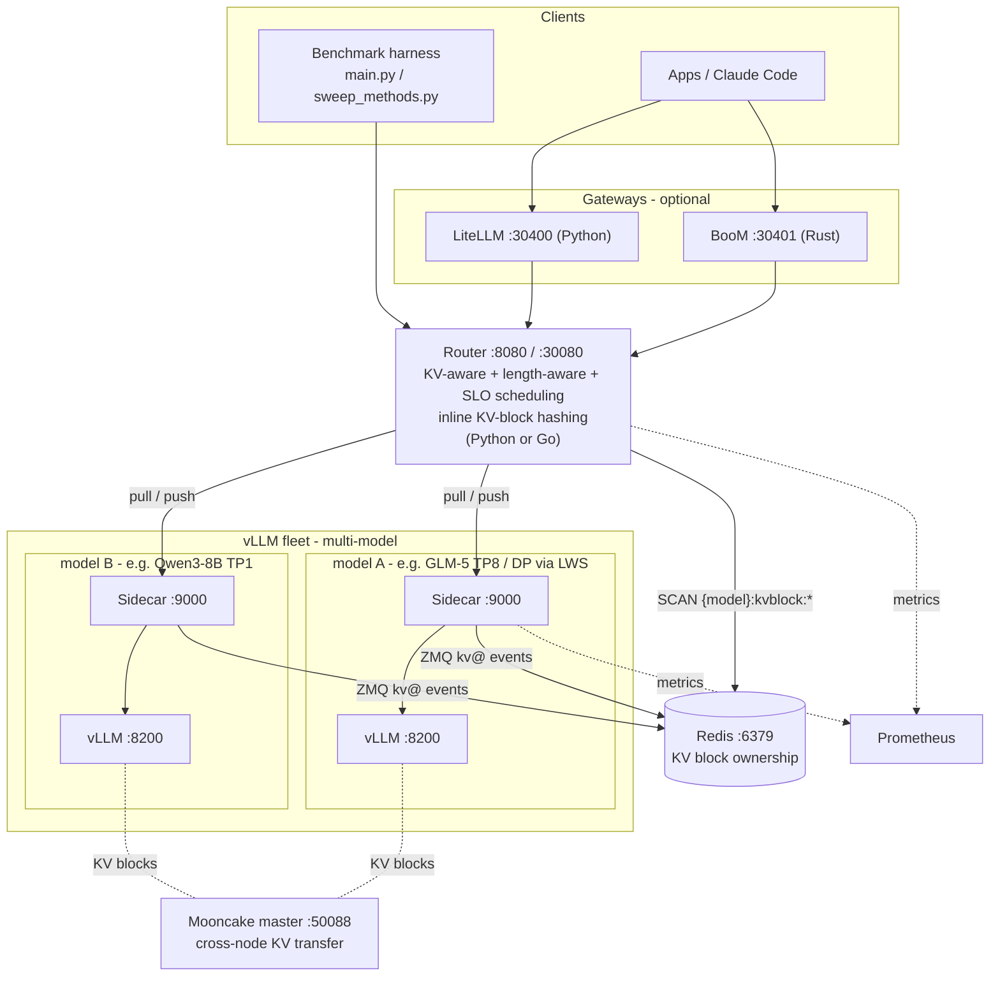

<div align="center">

# 💥 LA-Boom

**KV-aware load balancing and benchmarking for vLLM — at cluster scale.**

*Route for cache reuse, not round-robin. Then prove it with reproducible sweeps.*


[Quickstart](#quickstart-60-seconds) · [Architecture](#architecture) · [Capabilities](#key-capabilities) · [Compatibility](#compatibility) · [Docs](docs/README.md)

</div>

---

One repository, two systems that fit together:

- **A distributed serving platform** — a KV-, length-, and SLO-aware router with per-pod sidecars wrapped around vLLM.
- **A reproducible benchmark harness** — an open-loop load generator plus an automated Helm sweep runner.

Deploy it, route through it, and systematically prove which strategy wins — all on Kubernetes, all reproducible.

## 🤔 Why LA-Boom

> **The one-liner:** vLLM's prefix cache makes *where* a request lands matter enormously. Round-robin throws that away. LA-Boom doesn't.

- **Most routers are cache-blind.** LA-Boom scores every queued request against each replica's *live* KV-block ownership and places it for maximum prefix reuse — higher hit rates, lower TTFT.
- **Length and deadlines are first-class.** Routing is length-aware (short-first / long-first batching) and SLO-aware (slack-based deadline scheduling), not an afterthought.
- **Claims need receipts.** One `sweep_methods.py` run deploys each strategy via Helm, drives *identical* open-loop traffic, and archives per-request logs, Prometheus metrics, and rendered manifests — apples-to-apples, every time.

## 🏗️ Architecture



**How the loop closes:** the router holds a central queue and either **pulls** work to sidecars on demand (capacity-gated, the default) or **pushes** it proactively. Sidecars subscribe to vLLM's ZMQ KV events and record block ownership in Redis; the router watches Redis to build a live `block hash → replica` map for prefix-aware placement. KV-block hashing runs **inside the router by default** (in-process for Python, a tiny in-container hasher for Go); the standalone prefix-hash service is an optional legacy mode (`KV_HASH_SOURCE=external`). Full tour → [docs/architecture/overview.md](docs/architecture/overview.md).

## ⚡ Key capabilities

- **Routing** — pull (capacity-gated, default) and push (`push-rr`, `push-random`, `push-leastq`); KV-aware prefix-tier ordering; length-aware batching (`short_first`, `long_first`); SLO-aware slack scheduling.
- **Serving** — many models from one cluster; multi-node data parallel via [LeaderWorkerSet](docs/deployment/data-parallel-lws.md) with expert parallel for MoE models (e.g. GLM-5); cross-node KV transfer via [Mooncake / LMCache](docs/deployment/mooncake/helm-integration.md).
- **Autoscaling** — per-model [KEDA autoscaling](docs/operations/autoscaling.md) across every topology (dense, multi-model, data-parallel LWS) on router-queue or vLLM KV-cache signals; off by default, fully backward compatible.
- **Benchmarking** — open-loop load generator with `det`, `poisson`, `bursty`, `steps`, and `rand` patterns; multi-turn conversations; streaming TTFT/TPOT measurement; automated Helm sweeps with full artifact capture.
- **Gateways** — [BooM Gateway](docs/gateways/boom/overview.md) (Rust) and LiteLLM (Python) for auth, virtual keys, rate limiting, and spend tracking; Claude Code support.
- **Observability** — Prometheus metrics, per-request [tracing](docs/architecture/trace.md), and live Redis KV-state inspection.

## 🧩 Compatibility

LA-Boom is a routing/benchmark layer around **unmodified vLLM**, so it inherits vLLM's model support and adds Kubernetes-native wiring on top.

| Area | Works with | Notes |
|------|-----------|-------|
| Inference engine | **vLLM** (OpenAI-compatible API) | Router + sidecar wrap stock vLLM; no engine fork |
| KV transfer | **Mooncake** (default) and **LMCache** P2P + host-staging | Switch via `lmcache.mode: mooncake \| p2p` — see [lmcache-p2p-host-staging.md](docs/internal/lmcache-p2p-host-staging.md) and [Mooncake integration](docs/deployment/mooncake/helm-integration.md) |
| Parallelism | **Tensor parallel** (TP), **data parallel** (DP) + **expert parallel** (EP) for MoE | DP/EP via [LeaderWorkerSet](docs/deployment/data-parallel-lws.md) (e.g. GLM-5 TP8+DP) |
| Orchestration | **Kubernetes 1.28+**, **Helm 3.12+**, **LeaderWorkerSet** | Deploy/sweep via the `vllm-kv-stack` chart |
| Autoscaling | **KEDA** | Per-model, opt-in, on router-queue or vLLM KV-cache signals ([autoscaling.md](docs/operations/autoscaling.md)) |
| Gateways / auth | **BooM Gateway** (Rust), **LiteLLM** (Python) | Virtual keys, rate limiting, spend tracking |
| Clients | **OpenAI API**, **Claude Code** | Anthropic-style access via BooM/LiteLLM |
| State / storage | **Redis** (KV-block ownership), **NFS** (model weights), private registry | |
| Observability | **Prometheus** + **Grafana** (kube-prometheus-stack) | Metrics, dashboards, per-request tracing |
| Models (validated) | GLM-5, MiniMax-M2, Qwen3 | Any vLLM-supported model works |

## 🚀 Quickstart (60 seconds)

> **Prerequisites:** a Kubernetes cluster with `kubectl` and Helm 3.12+, model weights reachable from worker nodes, and a private image registry. Full details in [docs/getting-started/prerequisites.md](docs/getting-started/prerequisites.md).

```bash
# 1. One-time: create the model PV/PVC
helm upgrade --install vllm ./src/vllm-kv-stack -n vllm --create-namespace \
  --set modelVolume.create=true --set modelVolume.modelSubPath=placeholder

# 2. Deploy vLLM
cd src
python deploy_vllm.py --config configs/router-tp8-glm.yaml

# 3. Run a load experiment
python main.py --config router --n 500
```

Then read the results like a pro → [full walkthrough](docs/getting-started/quickstart.md).

## Documentation

Everything lives in the **[documentation index](docs/README.md)**. Jump by role:

| I want to… | Start here |
|------------|-----------|
| Get running fast | [Getting Started](docs/getting-started/quickstart.md) |
| Understand the design | [Architecture overview](docs/architecture/overview.md) · [Router strategies](docs/architecture/router-strategies.md) · [KV cache flow](docs/architecture/kv-cache-flow.md) |
| Configure a deploy | [Client config](docs/configuration/client-config.md) · [Helm values](docs/configuration/helm-values.md) |
| Ship to production | [BooM Gateway](docs/gateways/boom/overview.md) |
| Deploy at scale | [Multi-model serving](docs/deployment/multi-model.md) · [GLM-5 reference ("HQ") deployment](docs/deployment/docker-reference/glm5-dp-docker.md) |
| Operate the cluster | [Cluster setup](docs/operations/cluster-setup.md) · [Registry & image builds](docs/operations/registry.md) · [Image patches](docs/operations/image-patches.md) |
| Benchmark & analyze | [Load patterns](docs/benchmarking/load-patterns.md) · [Artifacts & analysis](docs/benchmarking/artifacts-and-analysis.md) |
| See the roadmap | [docs/internal/](docs/internal/) |

## Repository layout

```
.
├── README.md                 # This landing page
├── docs/                     # Documentation (see docs/README.md)
├── analysis-notebooks/       # Post-experiment analysis notebooks
├── infra/                    # Cluster-prep automation (docs: docs/operations/cluster-prep-automation.md)
└── src/
    ├── main.py               # Load experiment entry point
    ├── sweep_methods.py      # Automated Helm sweep runner
    ├── deploy_vllm.py        # vLLM-only deployment
    ├── config.py             # Client + Helm configuration schema
    ├── configs/              # Client and sweep YAML configs
    ├── services/             # Router, sidecar (Python + Go), prefix-hash
    └── vllm-kv-stack/        # Helm chart (Redis, router, vLLM, gateways, ...)
```

---

<div align="center">

Built for real clusters. Router, sidecar, prefix-hash, and gateway images ship to a private registry; internal specifics (registry hostnames, NFS servers, node labels) live under [docs/operations/](docs/operations/), and examples elsewhere use placeholders like `<node-ip>` and `<repo-root>`.

</div>
