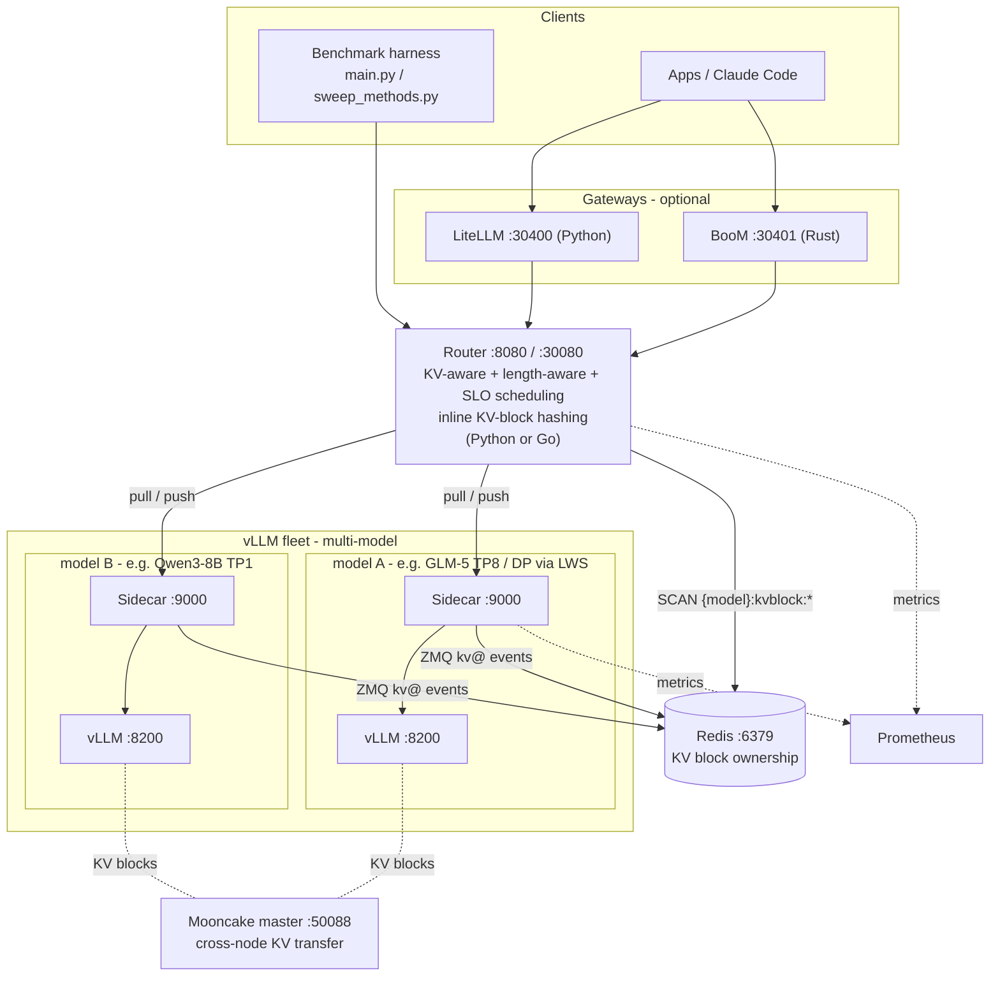

# LA-Boom

**A Kubernetes-native, KV-aware load balancer and benchmark framework for vLLM serving.**

One repository, two systems: a **distributed serving platform** (a KV-, length-, and SLO-aware router with per-pod sidecars around vLLM) and a **reproducible benchmark harness** (an open-loop load generator plus an automated Helm sweep runner). Together they let you deploy, route, and systematically evaluate LLM inference at scale on Kubernetes.


---

## Why LA-Boom

- **Most routers ignore the KV cache.** vLLM's prefix cache makes request placement matter enormously. LA-Boom scores every queued request against each replica's live KV-block ownership and routes for maximum prefix reuse.
- **Length and deadlines matter too.** Routing is length-aware (short-first / long-first batching) and SLO-aware (slack-based deadline scheduling), not just round-robin.
- **Fair evaluation is hard.** A single `sweep_methods.py` run deploys each routing strategy via Helm, drives identical open-loop traffic, and archives per-request logs, Prometheus metrics, and rendered manifests for apples-to-apples comparison.

## Architecture



The router holds a central queue and either **pulls** work to sidecars on demand (capacity-gated, the default) or **pushes** it proactively. Sidecars subscribe to vLLM's ZMQ KV events and record block ownership in Redis; the router watches Redis to build a live `block hash → replica` map used for prefix-aware placement. KV-block hashing runs **inside the router by default** (in-process for Python, in a tiny in-container hasher for Go); the standalone prefix-hash service is an optional legacy mode (`KV_HASH_SOURCE=external`). See [docs/architecture/overview.md](docs/architecture/overview.md).

## Key capabilities

- **Routing** — pull (capacity-gated, default) and push (`push-rr`, `push-random`, `push-leastq`); KV-aware prefix-tier ordering; length-aware batching (`short_first`, `long_first`); SLO-aware slack scheduling.
- **Serving** — multiple models from one cluster; multi-node data parallel via [LeaderWorkerSet](docs/deployment/data-parallel-lws.md) with expert parallel for MoE models (e.g. GLM-5); cross-node KV transfer via [Mooncake / LMCache](docs/deployment/mooncake/helm-integration.md); router and sidecar in both **Python and Go**.
- **Autoscaling** — per-model [KEDA autoscaling](docs/operations/autoscaling.md) across all topologies (dense, multi-model, data-parallel LWS) on router-queue or vLLM KV-cache signals; off by default and fully backward compatible.
- **Benchmarking** — open-loop load generator with `det`, `poisson`, `bursty`, `steps`, and `rand` patterns; multi-turn conversations; streaming TTFT/TPOT measurement; automated Helm sweeps with full artifact capture.
- **Gateways** — [BooM Gateway](docs/gateways/boom/overview.md) (Rust) and LiteLLM (Python) for auth, virtual keys, rate limiting, and spend tracking; Claude Code support.
- **Observability** — Prometheus metrics, per-request [tracing](docs/architecture/trace.md), and live Redis KV-state inspection.

## Quickstart (60 seconds)

> Prerequisites: a Kubernetes cluster with `kubectl` and Helm 3.12+, model weights reachable from worker nodes, and a private image registry. Full details in [docs/getting-started/prerequisites.md](docs/getting-started/prerequisites.md).

```bash
# 1. One-time: create the model PV/PVC
helm upgrade --install vllm ./src/vllm-kv-stack -n vllm --create-namespace \
  --set modelVolume.create=true --set modelVolume.modelSubPath=placeholder

# 2. Deploy vLLM
cd src
python deploy_vllm.py --config configs/router-tp8-glm.yaml

# 3. Run a load experiment
python main.py --config router --n 500
```

Full walkthrough: [docs/getting-started/quickstart.md](docs/getting-started/quickstart.md).

## Documentation

Start at the **[documentation index](docs/README.md)**. Highlights:

- New here → [Getting Started](docs/getting-started/quickstart.md)
- How it works → [Architecture overview](docs/architecture/overview.md) and [KV cache flow](docs/architecture/kv-cache-flow.md)
- Configure → [Client config](docs/configuration/client-config.md) and [Helm values](docs/configuration/helm-values.md)
- Production path → [BooM Gateway](docs/gateways/boom/overview.md)
- Deploy → [Multi-model serving](docs/deployment/multi-model.md) and the bare-Docker [GLM-5 reference ("HQ") deployment](docs/deployment/docker-reference/glm5-dp-docker.md) that the Helm/LWS path mirrors
- Operate → [Cluster setup](docs/operations/cluster-setup.md), [registry & image builds](docs/operations/registry.md), [BooM build](docs/gateways/boom/build.md)
- Benchmark → [Load patterns](docs/benchmarking/load-patterns.md) and [artifacts & analysis](docs/benchmarking/artifacts-and-analysis.md)
- Design & roadmap → [docs/internal/](docs/internal/)

## Repository layout

```
.
├── README.md                 # This landing page
├── docs/                     # Documentation (see docs/README.md)
├── infra/                    # Ansible cluster-prep automation (see infra/README.md)
└── src/
    ├── main.py               # Load experiment entry point
    ├── sweep_methods.py      # Automated Helm sweep runner
    ├── deploy_vllm.py        # vLLM-only deployment
    ├── config.py             # Client + Helm configuration schema
    ├── configs/              # Client and sweep YAML configs
    ├── services/             # Router, sidecar (Python + Go), prefix-hash
    ├── vllm-kv-stack/        # Helm chart (Redis, router, vLLM, gateways, ...)
    └── jupyters/             # Post-experiment analysis notebooks
```

---

> Router, sidecar, prefix-hash, and gateway images are pushed to a private registry. Internal cluster specifics (registry hostnames, NFS servers, node labels) are documented under [docs/operations/](docs/operations/); examples elsewhere use placeholders like `<node-ip>` and `<repo-root>`.
