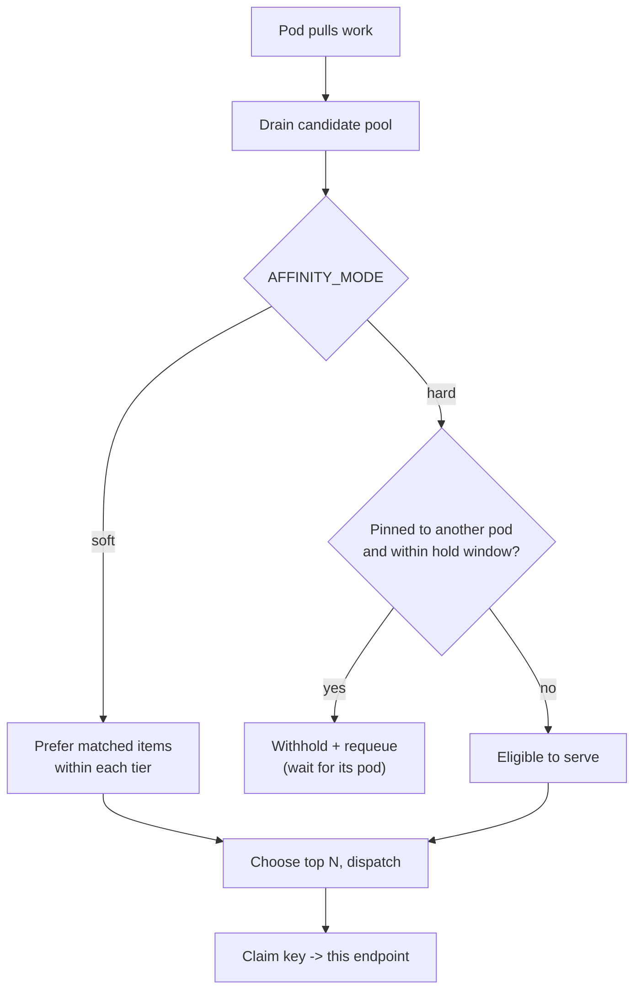

# Conversation Key Affinity

> For a high-level overview of the routing strategies and where affinity fits,
> see [router-strategies.md](router-strategies.md).

Key affinity keeps **all turns of a single chat conversation on the same vLLM
pod**, so the engine's internal prefix cache (and any KV blocks the router
already tracks) are reused turn-to-turn instead of being recomputed on a
different pod. It is a deliberately simple stickiness heuristic that layers on
top of the existing pull-based, KV-aware, and SLO-aware scheduling.

It is **disabled by default** (`AFFINITY_ENABLED=false`). When off, the routing
path is byte-for-byte identical to before — there is zero impact on existing
deployments.

---

## 1. Why

vLLM's automatic prefix caching is per-engine: pod A's cache does not help pod B.
In a multi-turn conversation each turn resends the full history, so if turn 2
lands on a different pod than turn 1, the whole prompt prefix is recomputed cold.
Routing the conversation back to the pod that already processed the previous turn
turns those cold prefills into cache hits.

This is intended as a pragmatic measure until cross-pod prefix caching is
stronger; it is fully reversible by flipping one flag.

---

## 2. Key properties

- **Router-side only.** No changes to BooM, the sidecars, vLLM, or any client.
  The router derives conversation identity itself and never depends on an
  upstream conversation ID.
- **Independent of BooM.** Works whether traffic arrives via BooM, LiteLLM, the
  load-test client, or a direct `POST /v1/chat/completions` / `POST /enqueue`.
- **Backward compatible.** The affinity key lives in an internal `meta` field
  (`__affinity_key__`); it is ignored everywhere it is not understood.
- **Python and Go parity.** Both router implementations behave identically (same
  env vars, same metrics, same hold/release semantics).

---

## 3. How a conversation is detected

There is no conversation ID on the wire. The router derives a stable key from the
**opening prefix** of the conversation:

```
sha256( "model:<model>" | "system:<system prompt>" | "user:<first user message>" )[:16]
```

Because every turn of an OpenAI/Anthropic-style chat resends the entire message
history, the system prompt and first user message are identical on turn 1, turn
2, turn N — so the derived key is identical across the whole conversation. Later
turns (which differ only in the appended messages) do not change the key.

Notes:

- Content-block arrays (`content: [{type:"text", text:"..."}]`) are flattened to
  text, so block-form and string-form messages hash the same.
- If there is no user message yet, no key is derived and the request routes
  normally (no affinity).
- A client may override derivation by passing `meta.affinity_key` explicitly
  (used by some load-test scenarios). This takes precedence over the derived key.

Derivation lives in [`router/affinity.py`](../../src/services/router_service/router/affinity.py)
(`derive_affinity_key`) and [`internal/gateway/affinity.go`](../../src/services/go/internal/gateway/affinity.go)
(`deriveAffinityKey`).

---

## 4. The affinity map

A thread-safe `conversation key → endpoint` map with TTL expiry records which pod
last served each conversation. On every dispatch, the router claims (refreshes)
the mapping to the endpoint that actually pulled the request, so affinity always
follows the most recent cache. Entries expire after `AFFINITY_TTL_S` of
inactivity.

---

## 5. Modes

### Soft (`AFFINITY_MODE=soft`) — preference

Within each KV/SLO scheduling tier, requests whose conversation maps to the
pulling endpoint are stably moved to the front. Any pod may still serve any
request — affinity is only a preference, so it never withholds work or hurts
utilization. This is the recommended default.

- Legacy path: applied as a stable partition inside `_legacy_sort` after KV
  tiering and length refinement.
- SLO path: applied as a tiebreak **inside the slack band**, so urgency (slack)
  still dominates; affinity only orders requests of comparable urgency.

### Hard (`AFFINITY_MODE=hard`) — time-bounded pin

A request whose conversation is pinned to a *different* endpoint is **withheld**
from the pulling pod and requeued, so it waits for its own pod. To prevent
starvation (e.g. the pinned pod is overloaded or gone), each request carries a
router-stamped timestamp; once `AFFINITY_HARD_TIMEOUT_S` elapses the request is
**released** to any pod.

Hard mode maximizes cache reuse at the cost of some head-of-line waiting. Use it
only when prefix reuse matters more than tail latency, and keep
`AFFINITY_HARD_TIMEOUT_S` small.



---

## 6. Interaction with other features

- **KV-aware routing:** Conceptually orthogonal but mechanically related. The
  affinity pod is usually also the pod with the most cached blocks, so in `soft`
  mode KV scoring and affinity reinforce each other (use `router_strategy: both`).
  They can also run in isolation — `prefix` (KV-awareness only) or `affinity`
  (stickiness only) — via the unified selector in §7. Note `hard` affinity can
  intentionally override the best KV match by withholding a request for its pinned
  pod.
- **SLO-aware routing:** Affinity is a *within-band* tiebreak only; deadline
  slack always wins, so affinity cannot push an urgent request behind a
  non-urgent one.
- **Autoscaling (KEDA):** In hard mode, withheld requests remain counted in the
  central queue depth, so the queue-based autoscaler still sees the backlog and
  can scale out. Affinity does not suppress the autoscaling signal.
- **Push modes:** Affinity targets pull mode (`ROUTER_MODE=pull`). In push modes
  the key is still stamped into `meta` but the central-queue sort is not used.

---

## 7. Configuration

### Unified strategy selector (recommended)

Affinity and prefix KV-awareness are toggled together with the single
`router_strategy` selector (`none | prefix | affinity | both`). The selector and
its four-way table are documented once in
[router-strategies.md](router-strategies.md#configuration); when set it
**overrides** the low-level `kvAware` / `affinityEnabled` flags below. The
`affinityMode` (`soft`/`hard`) and TTL/timeout knobs in this section still apply
whenever the chosen strategy includes affinity.

```yaml
# client config (src/configs/*.yaml)
helm:
  router_strategy: "affinity"   # none | prefix | affinity | both
  router_affinity_mode: "soft"  # soft | hard (only when affinity is on)
```

The selector is mirrored in both router implementations (Python
`router/config.py`, Go `internal/gateway/config.go`), so it behaves identically
regardless of `service_impl`.

### Low-level flags

These are what the selector derives; set them directly only if you leave
`router_strategy` empty.

| Key | Env | Default | Purpose |
|-----|-----|---------|---------|
| `kvAware` | `KV_AWARE` | `true` | Prefix KV-awareness master switch |
| `affinityEnabled` | `AFFINITY_ENABLED` | `false` | Key-affinity master switch |
| `affinityMode` | `AFFINITY_MODE` | `soft` | `soft` \| `hard` |
| `affinityTtlS` | `AFFINITY_TTL_S` | `300` | Mapping lifetime (s) |
| `affinityHardTimeoutS` | `AFFINITY_HARD_TIMEOUT_S` | `5` | Hard-mode release window (s) |

Enable affinity directly in values:

```yaml
router:
  affinityEnabled: true
  affinityMode: soft   # or: hard
  affinityTtlS: 300
  affinityHardTimeoutS: 5
```

No image rebuild is required beyond shipping the updated router image; the
feature is purely additive and defaults to off.

---

## 8. Metrics

Exposed on the router `/metrics` endpoint:

| Metric | Type | Meaning |
|--------|------|---------|
| `router_affinity_hits_total` | counter | Requests dispatched to their affinity-target endpoint |
| `router_affinity_holds_total` | counter | Requests withheld from a non-matching endpoint (hard mode) |
| `router_affinity_releases_total` | counter | Requests released to any pod after the hard timeout |
| `router_affinity_map_size` | gauge | Live conversation → endpoint mappings |

A healthy soft-mode rollout shows `hits_total` climbing relative to dispatches.
In hard mode, watch `holds_total` vs `releases_total`: many releases means the
hold window is too short or the pinned pods are overloaded.

---

## 9. Source map

| Concern | Python | Go |
|---------|--------|----|
| Key derivation + map | `router/affinity.py` | `internal/gateway/affinity.go` |
| Config | `router/config.py` | `internal/gateway/config.go` |
| Key injection at admission | `router/api.py` (`_inject_affinity`) | `internal/gateway/handlers.go` + `chat.go` (`injectAffinity`) |
| Scheduling integration | `router/router_state.py` (`pull_for_endpoint`, `_legacy_sort`, `_slo_aware_sort`) | `internal/gateway/queue.go` + `slo.go` |
| Metrics | `router/metrics.py` | `internal/gateway/metrics.go` |
| Tests | `tests/test_affinity.py` | `internal/gateway/affinity_test.go` |
