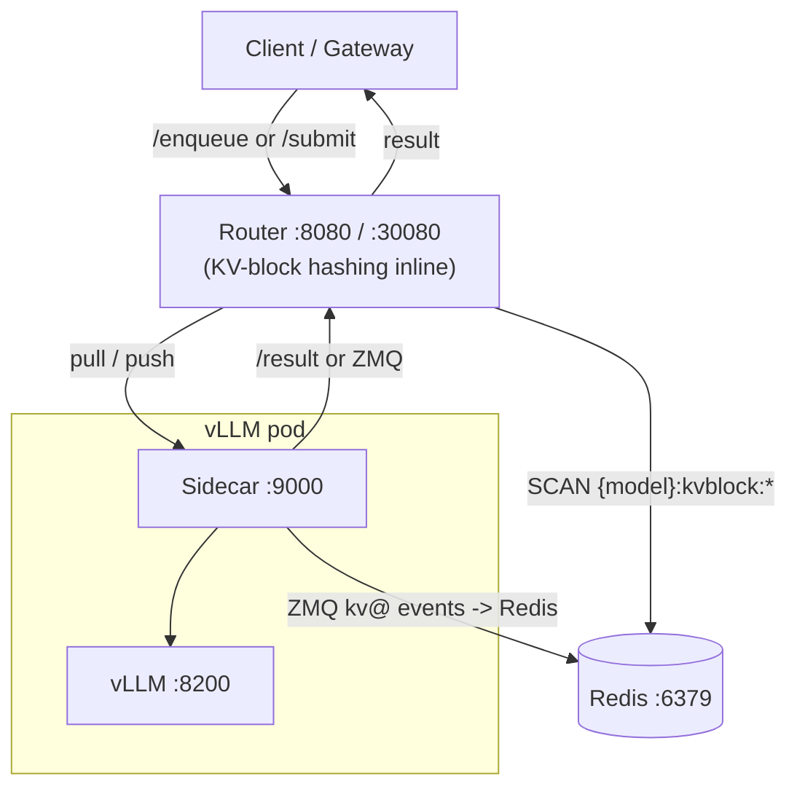

# Architecture overview

How the LA-Boom serving platform fits together. Start here, then dive into the component docs linked below.

## The big picture

LA-Boom places a custom **router** and per-pod **sidecars** around stock vLLM, plus **Redis** for KV-aware placement. KV-block hashing runs **inside the router by default** (in-process for the Python router; in a tiny in-container hasher for the Go gateway). The standalone **prefix-hash** service is an optional legacy mode (`KV_HASH_SOURCE=external`) and is the dashed box above — see [prefix-hash.md](prefix-hash.md).

## Components

| Component | Role | Port (ClusterIP / NodePort) | Deep dive |
|-----------|------|------------------------------|-----------|
| Router | Central queue, pull/push dispatch, KV/length/SLO scheduling, OpenAI shim, **inline KV-block hashing** | 8080 / 30080 (ZMQ results 5559 / 30559) | [router.md](router.md) |
| Sidecar | Per-pod local queue, vLLM forwarding, KV event reporting | 9000 (in-pod) | [sidecar.md](sidecar.md) |
| vLLM | Model inference (OpenAI-compatible API) | 8200 / 30034 (+offset) | — |
| Redis | KV block ownership (`{MODEL}:kvblock:*`) | 6379 / 30079 | [kv-cache-flow.md](kv-cache-flow.md) |
| Prefix-Hash *(legacy, external mode only)* | Standalone vLLM-compatible KV block hasher; deployed only when `KV_HASH_SOURCE=external` | 9095 / 30095 | [prefix-hash.md](prefix-hash.md) |

## Request lifecycle

1. A client sends a request to the router via `/enqueue` (synchronous, blocks for the result) or `/submit` (asynchronous, returns a `req_id`; results arrive over ZMQ).
2. If KV-aware routing is on, the router computes the request's block hashes (inline via `prefix_hash.py` by default) and records them in memory.
3. In **pull** mode, sidecars poll `/pull` when they have capacity; the router scores and returns the best-matching queued requests. In **push** mode, the router dispatches proactively (`push-rr`, `push-random`, `push-leastq`, `push-throughput`, `push-p2c`, `push-kv-cost`, `push-least-kv`, `push-least-latency`, `push-least-busy`; also `central-push` / `external-push`).
4. The sidecar forwards the request to its local vLLM and returns the result to the router (via `/result` or, for async, the router publishes over ZMQ).

## KV-aware routing in one paragraph

Each sidecar subscribes to vLLM's ZMQ KV-cache events and writes block ownership to Redis. The router runs a background watcher that scans Redis to build a live `block hash -> replica` map. At dispatch time the router scores each queued request by how many of its leading block hashes are already cached on a given replica, groups requests into KV-hit tiers, and (when length-aware routing is enabled) orders within each tier by predicted output length. Full detail: [kv-cache-flow.md](kv-cache-flow.md). For the four selectable routing strategies (`none/prefix/affinity/both`) with figures, see [router-strategies.md](router-strategies.md).

## Routing modes and policies

- **Dispatch modes**: `pull` (capacity-gated, default); push strategies `push-rr`, `push-random`, `push-leastq`, `push-throughput`, `push-p2c`, `push-kv-cost`, `push-least-kv`, `push-least-latency`, `push-least-busy`; plus `central-push` / `external-push`. Full descriptions: [router.md](router.md). Compatibility of each mode with prefix KV, affinity, sidecar-less delivery, fair-pull, soft divert, and token budgets: [Routing Compatibility Matrix](router.md#routing-compatibility-matrix).
- **Length-aware policies**: `short_first`, `long_first` (applied within KV tiers).
- **SLO-aware scheduling**: an alternative slack-based sort that orders by deadline headroom; see [slo-aware-routing.md](slo-aware-routing.md).

## Implementations

The router and sidecar exist in both **Python** (FastAPI) and **Go** (chi), selectable via the Helm value `serviceImpl`. They are near-identical ports sharing the same APIs, Redis schema, ZMQ formats, and metric names. KV-block hashing uses the same `prefix_hash.py` in both (in-process for Python; in-container for Go) by default. See [go-services.md](go-services.md).

## Transports

- **Synchronous**: client `POST /enqueue` blocks until the result is ready.
- **Asynchronous pub/sub**: client `POST /submit` returns immediately; the router publishes completions over ZMQ (`tcp://<router>:5559` / NodePort 30559), and the client subscribes.

## See also

- [Routing Compatibility Matrix](router.md#routing-compatibility-matrix) — dispatch × placement × rebalancing
- [Request tracing](trace.md) — per-request stage timing
- [Autoscaling](../operations/autoscaling.md) — per-model KEDA scaling on queue/KV-cache signals
- [Configuration: client config](../configuration/client-config.md) and [Helm values](../configuration/helm-values.md)
