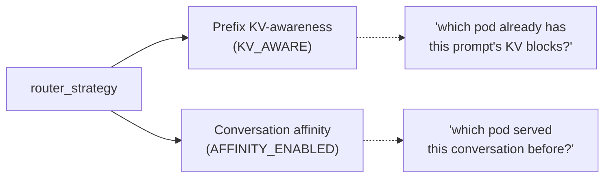
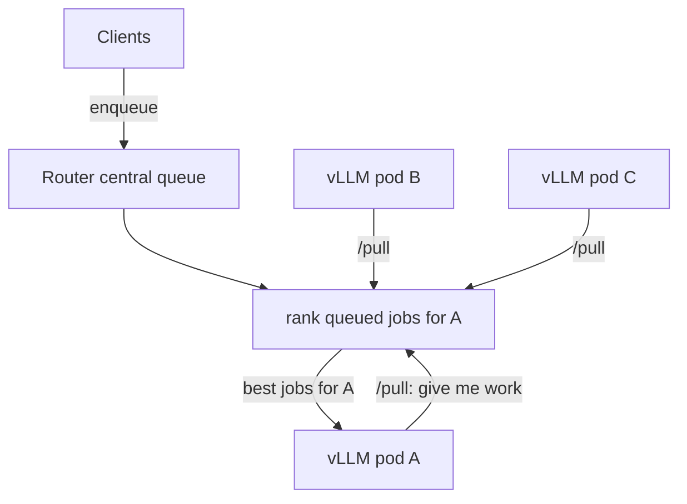
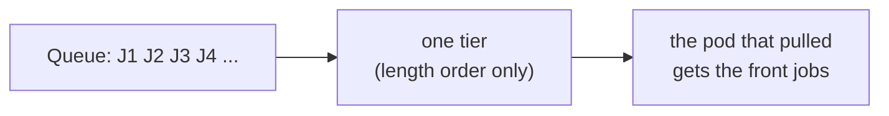
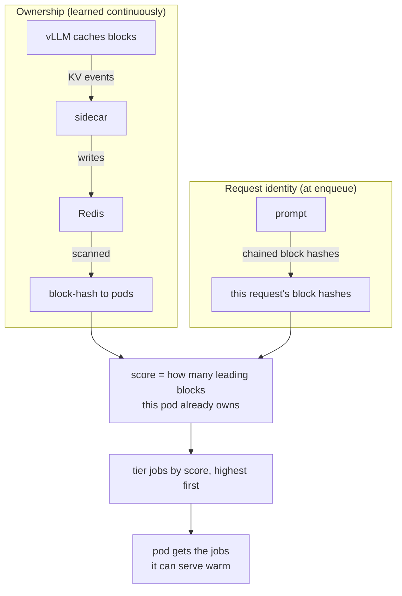
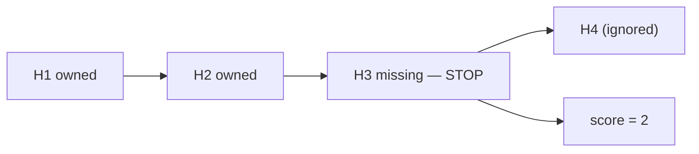
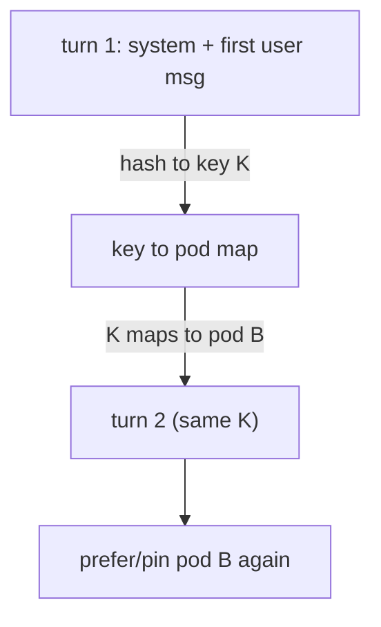
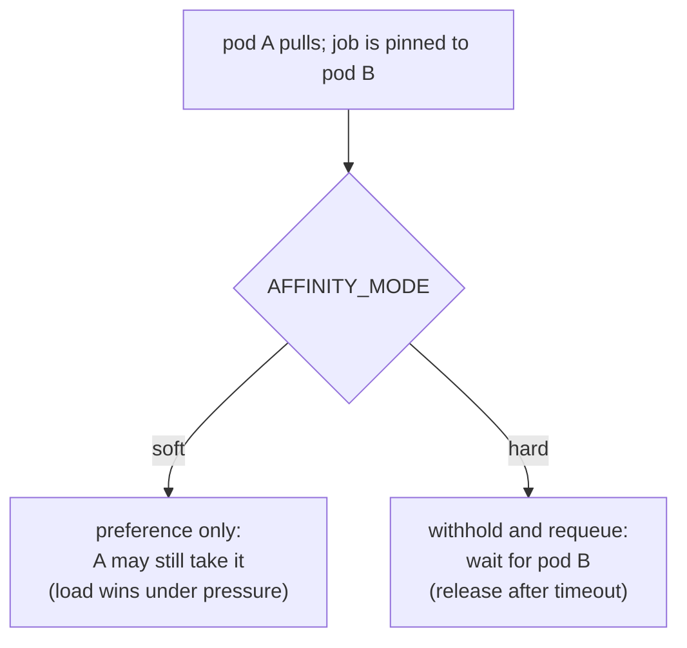
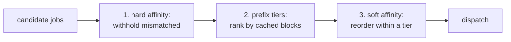

# Router Strategies

How the router decides **which pod serves which request**. This page covers the
four **placement** strategies at a high level with figures; the deep-dive pages
cover the internals (hashing, KV ownership, affinity mechanics).

The strategy is selected with a single knob, `router_strategy`
(`none | prefix | affinity | both`). See [Configuration](#configuration).

**Placement vs dispatch:** `router_strategy` (this page) is independent of
`router.mode` / `ROUTER_MODE`. Dispatch modes — `pull`, `push-rr`, `push-random`,
`push-leastq`, `push-throughput`, `push-p2c`, `push-kv-cost`, `push-least-kv`,
`push-least-latency`, `push-least-busy`, `central-push`, `external-push` — are
documented in [router.md](router.md).

---

## Two independent levers

`router_strategy` is a shorthand over **two independent switches**, each
answering a different question about where a request should go:



| `router_strategy` | Prefix KV-awareness | Conversation affinity |
|-------------------|---------------------|-----------------------|
| `none`            | off                 | off                   |
| `prefix`          | **on**              | off                   |
| `affinity`        | off                 | **on**                |
| `both`            | **on**              | **on**                |

The two levers are evaluated in different parts of the scheduler, so any
combination is valid. The sections below describe what each lever adds.

---

## The shared pull loop

All strategies run through one pull loop. Pods request work when they have
capacity; the strategy only changes **how the router ranks the queued jobs for
the requesting pod**. It does not change the API or which pod may serve which
request — the one exception is hard affinity (below).



For the queue, pull/push dispatch, and the HTTP/ZMQ APIs, see
[router.md](router.md).

---

## `none`

A single tier ordered only by the (always-on) length policy. Any job can go to
any pod. This is the baseline the other strategies are measured against.



---

## `prefix`

Prefix routing turns a cold prefill into a cache hit by matching a request to the
pod that already holds its prompt prefix in KV cache. It has two halves that meet
at scoring time:



The score counts the **contiguous** matching prefix and stops at the first gap,
since vLLM's prefix cache cannot skip a missing block:



Ownership source: by default (`router.ownerSource: lookup`) the router fetches the
request's own block owners directly from Redis at admit time (targeted `HGETALL`,
capped by `router.lookupMaxBlocks`), so the score above reflects fresh state and
`kv_hit` is truthful. The legacy `watcher` mode instead reads a background-scanned
shared map — retained for compatibility but prone to under-counting under load.

Internals:

- [prefix-hash.md](prefix-hash.md) — how request block hashes are produced
  (vLLM-compatible chained hashing, tool canonicalization, inline vs external).
- [kv-cache-flow.md](kv-cache-flow.md) — how block ownership is learned
  (vLLM → sidecar → Redis → targeted lookup / KVWatcher) and how `prefix_len`
  scoring/tiering works.

---

## `affinity`

Affinity does not look at tokens; it pins a whole **conversation** to a pod so the
engine's internal prefix cache is reused turn-to-turn. The router derives a stable
key from the conversation's opening (identical on every turn, since each turn
resends the history) and remembers which pod served it.



Two modes control how strongly the pin is enforced:



Internals: [key-affinity.md](key-affinity.md) — key derivation, the TTL map,
soft/hard semantics, metrics, and Python/Go parity.

---

## `both`

Affinity controls stickiness; prefix controls cache-warmth. They compose in one
pass and usually reinforce each other, since the sticky pod is normally also the
KV-warm pod:



Soft affinity is a within-tier reorder; hard affinity withholds before tiering.

---

## Configuration

Select the strategy with one knob. The modifiers apply only when affinity is on.

```yaml
# client config (src/client/configs/*.yaml)
helm:
  router_strategy: "both"        # none | prefix | affinity | both
  router_affinity_mode: "soft"   # soft | hard (only when affinity is on)
  router_owner_source: "lookup"  # lookup | watcher (owner source for prefix/both)
  router_lookup_max_blocks: 512  # cap on per-request owner lookups
```

- The selector overrides the low-level `KV_AWARE` / `AFFINITY_ENABLED` flags when
  set; leaving it empty falls back to those flags (backward compatible).
- Full knob reference: [helm-values.md](../configuration/helm-values.md) and the
  affinity-specific TTL/timeout knobs in [key-affinity.md](key-affinity.md#7-configuration).

---

## Internals index

| Topic | Page |
|-------|------|
| Queue, pull/push dispatch, APIs | [router.md](router.md) |
| Block hashing (request identity) | [prefix-hash.md](prefix-hash.md) |
| KV ownership flow + scoring | [kv-cache-flow.md](kv-cache-flow.md) |
| Conversation affinity internals | [key-affinity.md](key-affinity.md) |
| SLO-aware ordering (orthogonal) | [slo-aware-routing.md](slo-aware-routing.md) |
| Python/Go parity | [go-services.md](go-services.md) |
