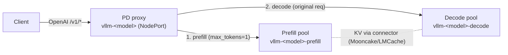

# Prefill/Decode (P/D) disaggregation — vanilla

Serve a model with the **prefill** phase (compute-bound prompt processing) and
the **decode** phase (memory-bandwidth-bound token generation) split onto
separate pools, so each can be sized and scaled independently. This page covers
the **vanilla** Helm topology shipped by the `vllm-kv-stack` chart: a prefill
pool, a decode pool, and a lightweight proxy that routes each request through
both. It is opt-in per model and does not affect the router/sidecar path.

> **Vanilla vs. router-integrated.** This is the simple, self-contained version:
> a proxy fronts a prefill pool and a decode pool, mirroring vLLM's reference
> disaggregation proxy. KV-aware, router-orchestrated P/D (the router picking
> both a prefill and a decode endpoint per request) is a separate roadmap item —
> see the roadmap's "prefill/decode disaggregation orchestration" entry.

## How it works

Prefill/decode disaggregation splits the two phases so a router/proxy selects a
prefill endpoint and a decode endpoint and coordinates a KV handoff between them:
the prefill engine (`kv_producer`) processes the prompt with `max_tokens=1`, then
the request is re-sent to the decode engine (`kv_consumer`), which reuses that KV
(pulled over the KV connector) and generates the output.

This chart's vanilla version implements that flow with a small proxy, reusing the
KV connector the chart already wires (Mooncake / LMCache).

## Topology



Per P/D-enabled model, `41-vllm-pd-disagg.yaml` renders:

| Resource | Name | Notes |
|----------|------|-------|
| Prefill Deployment + Service | `vllm-<model>-prefill` | vLLM pool, `component=vllm`, `pd-role=prefill` |
| Decode Deployment + Service | `vllm-<model>-decode` | vLLM pool, `component=vllm`, `pd-role=decode` |
| Proxy Deployment + **NodePort** Service | `vllm-<model>` | the model endpoint; CPU-only |
| Proxy code ConfigMap | `<release>-pd-proxy` | shared `pd_proxy.py`, mounted read-only |

P/D models are **skipped** by the standard deployment (`40-vllm-unified.yaml`),
KEDA (`60-keda-scaledobject.yaml`), and the router model registry
(`10-model-registry.yaml`) — the proxy is the entry point, independent of the
router/sidecar/Redis path.

## Request flow (the proxy)

The proxy (`pd_proxy.py`, aiohttp, shipped in the vLLM image) does, per request:

1. Receive an OpenAI request (`/v1/chat/completions` or `/v1/completions`).
2. **Prefill:** forward a copy with `max_tokens=1` (streaming off) to a prefill
   pod. This computes and publishes the prompt KV without real decoding.
3. **Decode:** forward the original request to a decode pod, which reuses that
   KV (pulled over the connector, or by prefix hash from the shared KV store),
   and **stream** the response straight back to the client.

It is connector-agnostic: if prefill returns `kv_transfer_params` (NIXL-style),
they're forwarded to decode; otherwise decode relies on the shared KV store
(Mooncake/LMCache). If prefill fails, the proxy falls back to decode-only
(correct output, just without the disaggregation benefit). Non-P/D paths (e.g.
`GET /v1/models`) pass through to a decode pod.

## Enable it

Add `prefillDecode.enabled: true` to a model in `models[]`. Because KV must move
between the pools, run a KV connector — the simplest path reuses the Mooncake
store the chart already supports (`mooncake.enabled: true`), so the pools inherit
its `kv_both` connector and decode pulls the prefix by hash.

```yaml
# my-values.yaml
mooncake:
  enabled: true          # provides the shared KV store the pools transfer through

models:
  - name: r1-qwen
    servedModelName: deepseek-r1-distill-qwen-1.5b
    modelSubPath: DeepSeek-R1-Distill-Qwen-1.5B
    tensorParallelSize: 1
    batchSize: 32
    prefillDecode:
      enabled: true
      prefill:
        replicas: 1
        # tensorParallelSize/batchSize default to the model's values when unset
      decode:
        replicas: 2      # decode is usually the bottleneck — give it more pods
      proxy:
        nodePort: 30036  # +portOffset; the endpoint
```

Then:

```bash
helm upgrade --install vllm ./src/core/vllm-kv-stack -n vllm -f my-values.yaml

# The proxy NodePort is the endpoint:
curl http://<node-ip>:30036/v1/chat/completions \
  -H "Content-Type: application/json" \
  -d '{"model":"deepseek-r1-distill-qwen-1.5b",
       "messages":[{"role":"user","content":"Explain PD disaggregation in one sentence."}],
       "max_tokens":100}'
```

### Dynamic P/D rebalancer (optional)

The chart can rebalance prefill/decode replica counts under a fixed card budget
based on proxy prefill backlog and decode KV pressure. It is opt-in per model:

```yaml
models:
  - name: r1-qwen
    prefillDecode:
      enabled: true
      dynamicRebalance:
        enabled: true          # opt this model into rebalancing
        minPrefillReplicas: 1
        minDecodeReplicas: 1
        maxTotalReplicas: 3    # fixed P+D budget
```

The rebalancer is **advisory by default** — with the chart default
`pdRebalancer.advisory: true` it only logs recommendations
(`[planner:advisory] ... not applied`) and never changes `Deployment /scale`.
To let the planner auto-apply the recommended targets, set:

```yaml
pdRebalancer:
  advisory: false   # planner auto-proposes and commits; the executor applies them
```

`pdRebalancer.dryRun: true` can be kept on as a rehearsal layer: the executor
logs planned transitions without changing `/scale`. See the
[P/D metrics contract](../architecture/pd-metrics-contract.md) for the
signals, decision rules, and transition protocol.

## Values schema

Global defaults live under `prefillDecode:` in `values.yaml`; per-model settings
under `models[].prefillDecode` override them (deep-merged, model wins).

| Key | Default | Meaning |
|-----|---------|---------|
| `prefillDecode.prefill.replicas` | `1` | prefill pod count |
| `prefillDecode.prefill.tensorParallelSize` | `null` → model TP | prefill TP |
| `prefillDecode.prefill.batchSize` | `null` → model batch | prefill `--max-num-seqs` |
| `prefillDecode.decode.replicas` | `1` | decode pod count |
| `prefillDecode.decode.tensorParallelSize` | `null` → model TP | decode TP |
| `prefillDecode.decode.batchSize` | `null` → model batch | decode `--max-num-seqs` |
| `prefillDecode.proxy.image` | `""` → `images.vllm` | proxy image (any Python image with aiohttp; CPU-only) |
| `prefillDecode.proxy.replicas` | `1` | proxy pod count |
| `prefillDecode.proxy.port` | `8200` | proxy container port |
| `prefillDecode.proxy.nodePort` | `30036` | external endpoint (`+portOffset`) |
| `prefillDecode.proxy.logLevel` | `info` | proxy log level |
| `prefillDecode.proxy.resources.*` | 200m/512Mi → 2/2Gi | proxy CPU/memory requests/limits |
| `prefillDecode.kvTransferConfig.prefill` | `""` → chart connector | raw `--kv-transfer-config` JSON for prefill |
| `prefillDecode.kvTransferConfig.decode` | `""` → chart connector | raw `--kv-transfer-config` JSON for decode |

### KV connector

- **Default (recommended):** leave `kvTransferConfig` empty. Each pool reuses the
  connector the standard deployment uses — `AscendStoreConnector`/`kv_both` when
  `mooncake.enabled`, or the `LMCacheAscendConnector*` when `lmcache.enabled`.
  The shared store makes decode pull the prompt prefix by hash, so no explicit
  producer→consumer handshake is required.
- **P2P connectors:** set the raw JSON per role, e.g. a `MooncakeConnector`
  `kv_producer` for prefill and `kv_consumer` for decode (see the bare-Docker
  [Mooncake P/D lab](docker-reference/mooncake-pd-test.md) for the exact config).

## Limitations (vanilla)

- No router/sidecar/KV-aware placement for P/D models — the proxy is round-robin
  over the pools (the pool Service also load-balances across pods). KV-aware,
  router-integrated P/D is a roadmap item.
- Per-model `nodePort` must be unique across P/D models on the same cluster.
- KEDA autoscaling is not wired for P/D pools yet (they're skipped in
  `60-keda-scaledobject.yaml`); scale `prefill.replicas` / `decode.replicas`
  manually.
- Requires a KV connector to realize the disaggregation benefit; without one,
  decode recomputes prefill (still correct).

## See also

- [Mooncake Helm integration](mooncake/helm-integration.md) — the shared KV store.
- [Bare-Docker Mooncake P/D lab](docker-reference/mooncake-pd-test.md) — manual
  producer/consumer reference the connector defaults are modeled on.
- [P/D metrics contract](../architecture/pd-metrics-contract.md) — dynamic
  rebalancer signals, decision rules, and transition protocol.
- [Data parallel + LWS](data-parallel-lws.md) — the other alternate topology.
