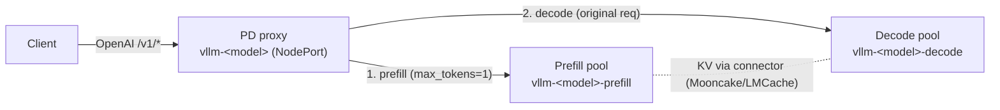

# Prefill/Decode (P/D) disaggregation — vanilla

Serve a model with the **prefill** phase (compute-bound prompt processing) and
the **decode** phase (memory-bandwidth-bound token generation) split onto
separate pools, so each can be sized and scaled independently. This page covers
the **vanilla** Helm topology shipped by the `vllm-kv-stack` chart: a prefill
pool, a decode pool, and a lightweight proxy that routes each request through
both. It is opt-in per model and does not affect the router/sidecar path.

> **Vanilla vs. router-integrated.** This is the simple, self-contained version:
> a proxy fronts a prefill pool and a decode pool, mirroring vLLM's reference
> disaggregation proxy. KV-aware, router-orchestrated P/D (the router picking
> both a prefill and a decode endpoint per request) is a separate roadmap item —
> see the roadmap's "prefill/decode disaggregation orchestration" entry.

## How it works

Prefill/decode disaggregation splits the two phases so a router/proxy selects a
prefill endpoint and a decode endpoint and coordinates a KV handoff between them:
the prefill engine (`kv_producer`) processes the prompt with `max_tokens=1`, then
the request is re-sent to the decode engine (`kv_consumer`), which reuses that KV
(pulled over the KV connector) and generates the output.

This chart's vanilla version implements that flow with a small proxy, reusing the
KV connector the chart already wires (Mooncake / LMCache).

## Topology



Per P/D-enabled model, `41-vllm-pd-disagg.yaml` renders:

| Resource | Name | Notes |
|----------|------|-------|
| Prefill Deployment + Service | `vllm-<model>-prefill` | vLLM pool, `component=vllm`, `pd-role=prefill` |
| Decode Deployment + Service | `vllm-<model>-decode` | vLLM pool, `component=vllm`, `pd-role=decode` |
| Proxy Deployment + **NodePort** Service | `vllm-<model>` | the model endpoint; CPU-only |
| Proxy code ConfigMap | `<release>-pd-proxy` | shared `pd_proxy.py`, mounted read-only |

P/D models are **skipped** by the standard deployment (`40-vllm-unified.yaml`),
KEDA (`60-keda-scaledobject.yaml`), and the router model registry
(`10-model-registry.yaml`) — the proxy is the entry point, independent of the
router/sidecar/Redis path.

## Request flow (the proxy)

The proxy (`pd_proxy.py`, aiohttp, shipped in the vLLM image) does, per request:

1. Receive an OpenAI request (`/v1/chat/completions` or `/v1/completions`).
2. **Prefill:** forward a copy with `max_tokens=1` (streaming off) to a prefill
   pod. This computes and publishes the prompt KV without real decoding.
3. **Decode:** forward the original request to a decode pod, which reuses that
   KV (pulled over the connector, or by prefix hash from the shared KV store),
   and **stream** the response straight back to the client.

It is connector-agnostic: if prefill returns `kv_transfer_params` (NIXL-style),
they're forwarded to decode; otherwise decode relies on the shared KV store
(Mooncake/LMCache). If prefill fails, the proxy falls back to decode-only
(correct output, just without the disaggregation benefit). Non-P/D paths (e.g.
`GET /v1/models`) pass through to a decode pod.

## Enable it

Add `prefillDecode.enabled: true` to a model in `models[]`. Because KV must move
between the pools, run a KV connector — the simplest path reuses the Mooncake
store the chart already supports (`mooncake.enabled: true`), so the pools inherit
its `kv_both` connector and decode pulls the prefix by hash.

```yaml
# my-values.yaml
mooncake:
  enabled: true          # provides the shared KV store the pools transfer through

models:
  - name: r1-qwen
    servedModelName: deepseek-r1-distill-qwen-1.5b
    modelSubPath: DeepSeek-R1-Distill-Qwen-1.5B
    tensorParallelSize: 1
    batchSize: 32
    prefillDecode:
      enabled: true
      prefill:
        replicas: 1
        # tensorParallelSize/batchSize default to the model's values when unset
      decode:
        replicas: 2      # decode is usually the bottleneck — give it more pods
      proxy:
        nodePort: 30036  # +portOffset; the endpoint
```

Then:

```bash
helm upgrade --install vllm ./src/core/vllm-kv-stack -n vllm -f my-values.yaml

# The proxy NodePort is the endpoint:
curl http://<node-ip>:30036/v1/chat/completions \
  -H "Content-Type: application/json" \
  -d '{"model":"deepseek-r1-distill-qwen-1.5b",
       "messages":[{"role":"user","content":"Explain PD disaggregation in one sentence."}],
       "max_tokens":100}'
```

## Values schema

Global defaults live under `prefillDecode:` in `values.yaml`; per-model settings
under `models[].prefillDecode` override them (deep-merged, model wins).

| Key | Default | Meaning |
|-----|---------|---------|
| `prefillDecode.prefill.replicas` | `1` | prefill pod count |
| `prefillDecode.prefill.tensorParallelSize` | `null` → model TP | prefill TP |
| `prefillDecode.prefill.batchSize` | `null` → model batch | prefill `--max-num-seqs` |
| `prefillDecode.decode.replicas` | `1` | decode pod count |
| `prefillDecode.decode.tensorParallelSize` | `null` → model TP | decode TP |
| `prefillDecode.decode.batchSize` | `null` → model batch | decode `--max-num-seqs` |
| `prefillDecode.proxy.image` | `""` → `images.vllm` | proxy image (any Python image with aiohttp; CPU-only) |
| `prefillDecode.proxy.replicas` | `1` | proxy pod count |
| `prefillDecode.proxy.port` | `8200` | proxy container port |
| `prefillDecode.proxy.nodePort` | `30036` | external endpoint (`+portOffset`) |
| `prefillDecode.proxy.logLevel` | `info` | proxy log level |
| `prefillDecode.proxy.resources.*` | 200m/512Mi → 2/2Gi | proxy CPU/memory requests/limits |
| `prefillDecode.kvTransferConfig.prefill` | `""` → chart connector | raw `--kv-transfer-config` JSON for prefill |
| `prefillDecode.kvTransferConfig.decode` | `""` → chart connector | raw `--kv-transfer-config` JSON for decode |

## Quiescent dynamic P/D rebalancing

The chart can also deploy a small, Kubernetes-native controller that changes
the two P/D Deployment replica counts under a fixed replica budget. It is an
opt-in **control-plane** feature: it does not inspect or route individual
requests, and it does not hot-convert a running vLLM process.

Enable it per P/D model. `maxTotalReplicas: 0` uses the initial P+D total as
the budget. The two roles must use the same tensor parallel size, and each role
keeps at least one replica in this first implementation.

```yaml
models:
  - name: r1-qwen
    servedModelName: deepseek-r1-distill-qwen-1.5b
    modelSubPath: DeepSeek-R1-Distill-Qwen-1.5B
    tensorParallelSize: 1
    prefillDecode:
      enabled: true
      prefill: {replicas: 2}
      decode: {replicas: 1}
      dynamicRebalance:
        enabled: true
        minPrefillReplicas: 1
        minDecodeReplicas: 1
        maxTotalReplicas: 3
```

The release renders `<release>-pd-rebalancer`, a CPU-only Deployment and
ClusterIP Service. Its namespaced Role can `get`/`patch` only the selected
model's Prefill and Decode Deployments (including `/scale`) and its own state
ConfigMap. No cluster-wide permissions, accelerator access, or request-path
permissions are granted.

Use a port-forward for the first operational loop. Targets are two-phase: a
proposal is validated and persisted, then a separate commit applies it:

```bash
kubectl -n vllm port-forward service/vllm-pd-rebalancer 8081:8081

# Propose P1,D2 (validated against budget/role floors; not yet applied).
curl -X POST http://127.0.0.1:8081/v1/targets/r1-qwen/propose \
  -H 'content-type: application/json' \
  -d '{"prefill":1,"decode":2,"reason":"decode KV pressure"}'

# Inspect current replicas, the pending proposal, and the committed target.
curl http://127.0.0.1:8081/v1/targets/r1-qwen

# Commit: the controller applies P2,D1 -> P1,D1 -> P1,D2.
curl -X POST http://127.0.0.1:8081/v1/targets/r1-qwen/commit

# Drop the proposal without applying it.
curl -X POST http://127.0.0.1:8081/v1/targets/r1-qwen/discard

kubectl -n vllm rollout status deployment/vllm-r1-qwen-prefill
kubectl -n vllm rollout status deployment/vllm-r1-qwen-decode
```

For a trial run without touching `/scale`, set `pdRebalancer.dryRun: true` in
values (or `PD_REBALANCER_DRY_RUN=true` in the container env). The controller
keeps reconciling and logs every transition it would apply as
`[DRY-RUN] ... would apply [...]`, but never patches the Deployments; `/healthz`
reports the flag as `dryRun`.

For a fixed budget, the controller applies `P2,D1 -> P1,D1 -> P1,D2`: it first
scales down the source role, waits for the Deployment status to converge, then
scales up the target role and waits for readiness. The reverse direction uses
the symmetric order. The Service selector removes terminating Pods from future
requests as Kubernetes updates endpoints.

This is deliberately **quiescent**, not a zero-interruption drain protocol.
The vanilla P/D proxy has no per-Pod active-request or drain API, so start a
transition only after the workload is idle. Do not enable another HPA, KEDA
ScaledObject, or external controller for the same P/D Deployments: independent
controllers can overwrite each other's target replica count. A later online
version needs proxy-side drain acknowledgement before it changes `/scale`.

### Minimal Kubernetes lab

Use a dedicated namespace and an NPU worker whose device-plugin allocation is
reserved for this lab. Do not install a Kubernetes distribution on a shared
serving host merely for this test: node-level CNI, iptables, runtime, and device
plugin changes are host-wide. A shared 16-card host is acceptable only when its
cluster administrator has reserved the cards assigned to the lab; an NPU count
alone does not prove that the assigned physical cards are safe to use.

For the smallest `TP=1` exercise, begin at `P2,D1` and set a three-replica
budget. It needs three NPU allocations at steady state and throughout the
transition. For `TP=T`, reserve at least `3*T` NPUs. Before installing the
release, confirm that the device plugin has advertised usable NPU capacity and
that the model directory and all images are reachable from the worker:

```bash
kubectl get nodes -o custom-columns=NAME:.metadata.name,ASCEND:.status.allocatable.'huawei\.com/Ascend910'
kubectl -n lzm-pd-lab get pods
```

Create `pd-lab-values.yaml` using a model and image already validated for the
target Ascend runtime. `modelVolume.hostPath` must be a directory visible on the
worker node, not a path from the control-plane machine.

```yaml
images:
  vllm: <your-vllm-ascend-image>
modelVolume:
  create: true
  hostPath: /path/on/the/npu-worker/models
models:
  - name: qwen
    servedModelName: qwen
    modelSubPath: Qwen3-0.6B
    tensorParallelSize: 1
    prefillDecode:
      enabled: true
      prefill: {replicas: 2}
      decode: {replicas: 1}
      dynamicRebalance:
        enabled: true
        minPrefillReplicas: 1
        minDecodeReplicas: 1
        maxTotalReplicas: 3
```

Render first, then create a new release. Keep the first request test and the
scale transition separate so a connector or image issue is not confused with a
control-plane issue:

```bash
helm template vllm src/core/vllm-kv-stack -n lzm-pd-lab -f pd-lab-values.yaml > rendered.yaml
helm upgrade --install vllm src/core/vllm-kv-stack -n lzm-pd-lab --create-namespace -f pd-lab-values.yaml
kubectl -n lzm-pd-lab rollout status deployment/vllm-qwen-prefill --timeout=20m
kubectl -n lzm-pd-lab rollout status deployment/vllm-qwen-decode --timeout=20m
kubectl -n lzm-pd-lab rollout status deployment/vllm-qwen-pd-proxy --timeout=5m
```

First prove P/D and KV transfer with one fixed request ID. An HTTP `200` alone
is insufficient because the proxy deliberately supports a Decode-only fallback.
Keep the ID and require matching Prefill, Decode, and connector transfer/pull
evidence in the logs before attempting rebalancing. Also record host `npu-smi`
output before and after the request to verify that only the lab's reserved NPU
allocations were used.

When the system is idle, apply the target and watch the explicit intermediate
state. The controller must show `P1,D1` before it creates the second Decode pod:

```bash
kubectl -n lzm-pd-lab port-forward service/vllm-pd-rebalancer 8081:8081
curl -X POST http://127.0.0.1:8081/v1/targets/qwen \
  -H 'content-type: application/json' \
  -d '{"prefill":1,"decode":2}'
kubectl -n lzm-pd-lab get deployment vllm-qwen-prefill vllm-qwen-decode --watch
```

After both Deployments converge, repeat the fixed-ID P/D/KV test. Then reverse
the target to `{"prefill":2,"decode":1}` and repeat. If any rollout times
out, stop the experiment, preserve `kubectl describe` and controller logs, and
return to the last converged target; do not force an overlapping scale-up on a
fixed NPU budget.

### KV connector

- **Default (recommended):** leave `kvTransferConfig` empty. Each pool reuses the
  connector the standard deployment uses — `AscendStoreConnector`/`kv_both` when
  `mooncake.enabled`, or the `LMCacheAscendConnector*` when `lmcache.enabled`.
  The shared store makes decode pull the prompt prefix by hash, so no explicit
  producer→consumer handshake is required.
- **P2P connectors:** set the raw JSON per role, e.g. a `MooncakeConnector`
  `kv_producer` for prefill and `kv_consumer` for decode (see the bare-Docker
  [Mooncake P/D lab](docker-reference/mooncake-pd-test.md) for the exact config).

## Limitations (vanilla)

- No router/sidecar/KV-aware placement for P/D models — the proxy is round-robin
  over the pools (the pool Service also load-balances across pods). KV-aware,
  router-integrated P/D is a roadmap item.
- Per-model `nodePort` must be unique across P/D models on the same cluster.
- KEDA autoscaling is not wired for P/D pools yet (they're skipped in
  `60-keda-scaledobject.yaml`); scale `prefill.replicas` / `decode.replicas`
  manually.
- Requires a KV connector to realize the disaggregation benefit; without one,
  decode recomputes prefill (still correct).

## See also

- [Mooncake Helm integration](mooncake/helm-integration.md) — the shared KV store.
- [Bare-Docker Mooncake P/D lab](docker-reference/mooncake-pd-test.md) — manual
  producer/consumer reference the connector defaults are modeled on.
- [Data parallel + LWS](data-parallel-lws.md) — the other alternate topology.
