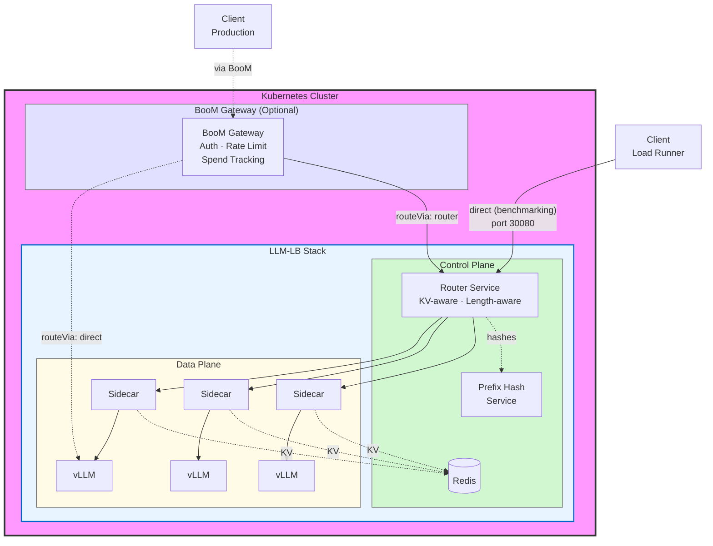
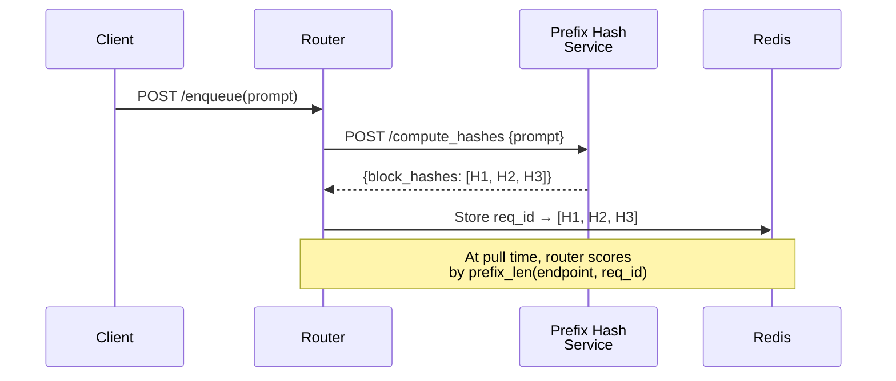
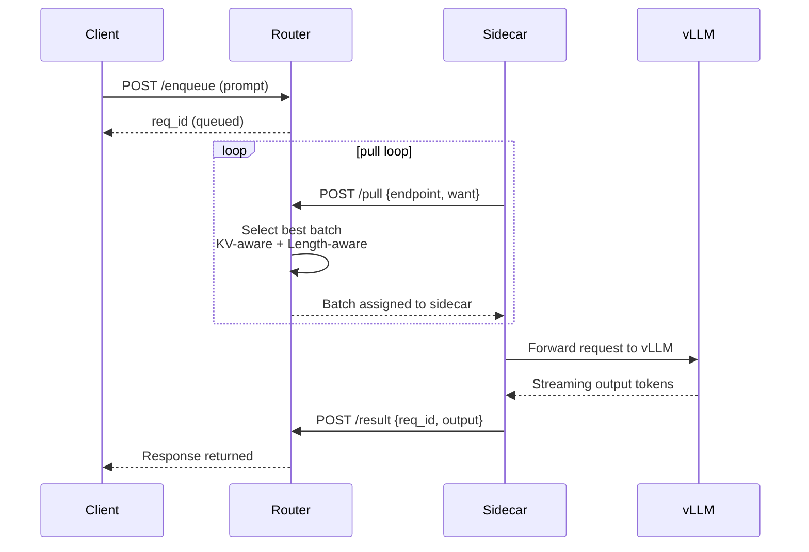
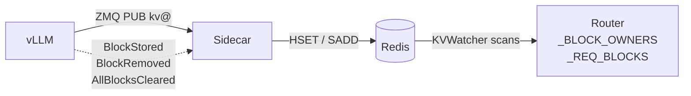
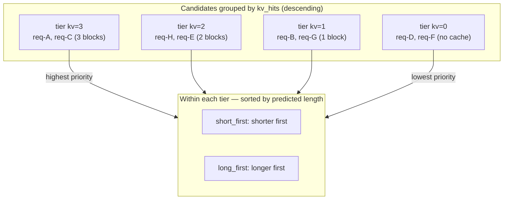
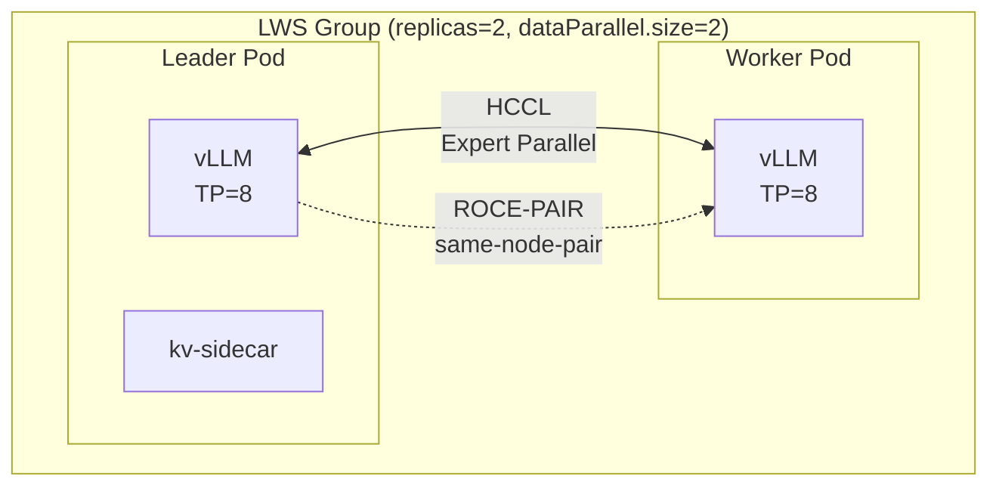
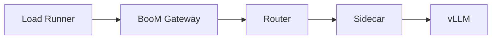

# LLM-LB: KV-Aware Load Balancer for LLM Serving

A microservice-based distributed vLLM serving system with KV-aware routing, length-aware batching, and multi-model support. Built for Huawei Ascend NPUs but designed generically.

## Table of Contents

1. [What This Project Does](#what-this-project-does)
2. [High-Level Architecture](#high-level-architecture)
3. [Core Components](#core-components)
   - [vLLM (Model Server)](#vllm-model-server)
   - [Router Service](#router-service)
   - [Sidecar](#sidecar)
   - [Redis (KV Cache State)](#redis-kv-cache-state)
   - [BooM Gateway](#boom-gateway)
   - [LiteLLM Proxy](#litellm-proxy)
   - [Prefix Hash Service](#prefix-hash-service)
   - [Mooncake (Cross-Node KV Transfer)](#mooncake-cross-node-kv-transfer)
4. [Routing Modes](#routing-modes)
   - [Pull Mode](#pull-mode)
   - [Push Mode](#push-mode)
   - [Choosing Between Pull and Push](#choosing-between-pull-and-push)
5. [KV-Aware Routing](#kv-aware-routing)
   - [How It Works](#how-it-works)
   - [Prefix Hash Computation](#prefix-hash-computation)
   - [KV Block Ownership](#kv-block-ownership)
   - [Scoring at Pull Time](#scoring-at-pull-time)
6. [Length-Aware Batching](#length-aware-batching)
7. [Multi-Model Support](#multi-model-support)
8. [Data Parallel Support](#data-parallel-support)
   - [Architecture](#architecture)
   - [LWS + DP Deployment Mode (router vs direct)](#lws--dp-deployment-mode-router-vs-direct)
   - [Configuration](#configuration)
   - [Node Labeling for RoCE Pair Topology](#node-labeling-for-roce-pair-topology)
9. [Sweep Experiment Configs](#sweep-experiment-configs)
   - [Naming Convention](#naming-convention)
   - [How sweep_methods.py Reads Configs](#how-sweep_methodspy-reads-configs)
   - [master_config.yaml Structure](#master_configyaml-structure)
   - [Direct Mode Helm Values](#direct-mode-helm-values)
   - [Running a Sweep](#running-a-sweep)
   - [Choosing a Config](#choosing-a-config)
10. [Deployment Getting Started](#deployment-getting-started)
   - [Prerequisites](#prerequisites)
   - [Step 0: One-Time PV/PVC Setup](#step-0-one-time-pvpvc-setup)
   - [Step 1: Deploy vLLM](#step-1-deploy-vllm)
   - [Step 2: Verify Cluster State](#step-2-verify-cluster-state)
   - [Step 3: Run Experiments](#step-3-run-experiments)
   - [Using --skip-vllm](#using---skip-vllm)
11. [Configuration Reference](#configuration-reference)
    - [Client Config Structure](#client-config-structure)
    - [Helm Values](#helm-values)
    - [Key Config Files](#key-config-files)
12. [Backend Options](#backend-options)
    - [Router (Benchmarking)](#router-benchmarking)
    - [AIBrix](#aibrix)
    - [BooM Gateway (Production)](#boom-gateway-production)
    - [LiteLLM (Production)](#litellm-production)
13. [Common Deployment Scenarios](#common-deployment-scenarios)
    - [Deploy GLM-5 with TP8](#deploy-glm-5-with-tp8)
    - [Deploy Qwen3-8B](#deploy-qwen3-8b)
    - [Run with Mooncake](#run-with-mooncake)
    - [Deploy with BooM Gateway](#deploy-with-boom-gateway)
13. [Monitoring and Debugging](#monitoring-and-debugging)
14. [Troubleshooting](#troubleshooting)

---

## What This Project Does

LLM-LB is a distributed system for serving large language models using vLLM with intelligent request routing. It provides:

1. **KV-Aware Routing**: Routes requests to pods that already have the prompt's KV cache blocks, avoiding redundant recomputation
2. **Length-Aware Batching**: Groups requests by predicted output length to reduce head-of-line blocking
3. **Pull and Push Modes**: Flexible work distribution between central queue (pull) and proactive dispatch (push)
4. **Multi-Model Support**: Serve multiple models from the same cluster with a shared router
5. **Data Parallelism**: LeaderWorkerSet (LWS) based multi-node training/serving for large models
6. **Production Gateways**: BooM (Rust) or LiteLLM (Python) for auth, rate limiting, and spend tracking

The system is designed for Huawei Ascend NPUs but the architecture is hardware-agnostic.

---

## High-Level Architecture

There are two deployment modes:

| Mode | Path | KV-Aware Routing | When to Use |
|------|------|-----------------|-------------|
| `routeVia: router` (default) | `Client → Router → Sidecar → vLLM` | ✅ | Benchmarking, KV-aware load balancing |
| `routeVia: direct` | `Client → BooM → vLLM directly` | ❌ | Production, lower latency, simpler setup |
| (no BooM) | `Client → Router → Sidecar → vLLM` | ✅ | Direct benchmarking access on port `30080` |



> **Why is BooM Gateway optional?**
> BooM is a **production API gateway** that sits in front of everything — it handles virtual API key auth (`sk-...`), rate limiting, and spend tracking. It is **not** part of the routing logic. For benchmarking, clients bypass BooM entirely and talk directly to the Router Service on port `30080`.

> **Router Service is mandatory in `routeVia: router` mode** — it is the central coordinator doing KV-aware + length-aware routing. It is only bypassed when using `routeVia: direct` (BooM → vLLM directly) or `backend: aibrix`.

Key components:
- **BooM Gateway** — Auth, rate limiting, spend tracking (production use only)
- **Router Service** — Central request queue, KV-aware + length-aware routing
- **Sidecar** — Per-pod local queue, pulls work from router
- **vLLM** — Model inference on NPUs
- **Redis** — KV block ownership state
- **Prefix Hash Service** — Computes prompt block hashes for KV routing

---

## Core Components

### vLLM (Model Server)

The actual LLM inference engine. This project uses vLLM with Huawei Ascend NPU support.

**Key Properties:**
- OpenAI-compatible API (`/v1/chat/completions`)
- Tensor Parallelism across 8 NPUs for large models
- KV cache management with block-level events
- ZMQ PUB socket for KV events (`kv@` topic)

**Configuration (via Helm values):**
```yaml  # vllm-kv-stack/values.yaml
vllm:
  gpuMemoryUtilization: 0.95      # KV cache memory fraction
  quantization: "ascend"           # W4A8 quantization for MoE models
  enableExpertParallel: true       # Enable for MoE models (GLM-5)
  maxModelLen: 80896              # Maximum sequence length
  maxNumBatchedTokens: 4096       # Batching limit
  kvCacheDtype: "auto"            # KV cache precision
```

**Key Files:**
- `vllm-k8s.yaml` - Standalone vLLM Pod manifest
- `vllm-kv-stack/templates/40-vllm-unified.yaml` - Helm template for vLLM Deployment

---

### Router Service

The central coordinator between clients and model workers. The router provides a **synchronous request/response** API to clients while internally handling complex routing decisions.

**Responsibilities:**
1. Receive prompts via `/enqueue`
2. Assign unique `req_id` to each request
3. Query prefix-hash service for KV block hashes (when KV-aware enabled)
4. Dispatch work via pull or push mode
5. Wait for sidecar `/result` and return to client

**Main Endpoints:**
| Endpoint | Direction | Purpose |
|----------|-----------|---------|
| `GET /health` | Client → Router | Liveness + queue length |
| `POST /enqueue` | Client → Router | Synchronous request submission |
| `POST /pull` | Sidecar → Router | Sidecar requests work (pull mode) |
| `POST /result` | Sidecar → Router | Sidecar returns model output |
| `POST /submit` | Client → Router | Async submission (ZMQ mode) |

**Routing Modes:**
- `pull` (default): Sidecars pull when ready
- `push-rr`: Round-robin push to sidecars
- `push-random`: Random sidecar selection
- `push-leastq`: Push to least-loaded sidecar

**Key Files:**
- `services/router_service/router/` - Router implementation
- `services/router_service/router/api.py` - Main HTTP handlers
- `services/router_service/router/router_state.py` - Queue management
- `services/router_service/router/kv_aware.py` - KV scoring logic

---

### Sidecar

Runs alongside each vLLM pod. Turns the pod into a well-behaved worker with local queuing and capacity management.

**Responsibilities:**
1. Maintain local queue of requests
2. Enforce `BATCH_SIZE` capacity limit
3. Pull work from router (pull mode) or receive pushed work
4. Forward requests to vLLM `/v1/chat/completions`
5. Post results back to router via `/result`
6. Subscribe to vLLM ZMQ events and update Redis with KV block ownership

**Local Queue Model:**
```
Capacity = BATCH_SIZE
pending + inflight ≤ BATCH_SIZE
When full, sidecar stops pulling from router
```

**Key Files:**
- `services/sidecar/sidecar/` - Sidecar implementation
- `services/sidecar/sidecar/main.py` - Entry point
- `services/sidecar/sidecar/vllm_client.py` - vLLM client
- `services/sidecar/sidecar/router_client.py` - Router communication

---

### Redis (KV Cache State)

Stores KV block ownership information for routing decisions.

**Key Schema:**
| Key Pattern | Type | Contents |
|-------------|------|----------|
| `{MODEL}:kvblock:{hash}` | HASH | `{pod_name: unix_timestamp}` |
| `{MODEL}:podblocks:{pod}` | SET | `{block_hash, ...}` |
| `{MODEL}:kvblocks` | HASH | Global block index |

**Write Path:** Sidecars write block ownership on `BlockStored` events from vLLM
**Read Path:** Router's KVWatcher reads to build in-memory `_BLOCK_OWNERS` map

**Deployment:** Single Redis pod via Helm (`10-redis.yaml`)

---

### BooM Gateway

A **Rust-based** production API gateway that provides auth, rate limiting, and spend tracking. Sits in front of the router for production deployments.

**Features:**
- Virtual key authentication (`sk-...`)
- Per-key/team spend tracking and budgets
- Rate limiting with named plans
- Multi-provider routing (OpenAI, Anthropic, Azure, Gemini, vLLM, Ollama)
- Embedded admin dashboard
- Zero-downtime config reloads via SIGHUP + ArcSwap
- Starts in ~1s (vs ~17s for LiteLLM)

**Deployment Modes:**
- `routeVia: router` (default) - BooM → Router → Sidecar → vLLM
- `routeVia: direct` - BooM → vLLM directly (bypasses our router)

**Key Files:**
- `docs/boom_gateway.md` - Full BooM documentation
- `docs/boom_claude.md` - Claude Code integration via BooM
- `vllm-kv-stack/templates/75-boom.yaml` - Helm deployment
- `vllm-kv-stack/values.yaml` - `boom:` section

---

### LiteLLM Proxy

A **Python-based** production API gateway (same role as BooM but in Python).

**Trade-offs vs BooM:**
| Aspect | LiteLLM | BooM |
|--------|---------|------|
| Runtime | Python + FastAPI | Rust + Axum |
| Startup time | ~17s | ~1s |
| Memory | 512Mi–2Gi | 128Mi–512Mi |
| Port | 30400 | 30401 |

**Key Files:**
- `docs/quickstart.md` - LiteLLM deployment steps
- `vllm-kv-stack/templates/70-litellm.yaml` - Helm deployment
- `vllm-kv-stack/values.yaml` - `litellm:` section

---

### Prefix Hash Service

Computes block hashes for incoming prompts. These hashes are used by the router to determine which pods have cached KV blocks for the prompt.

**How It Works:**


**Requirements:**
- Must replicate vLLM's internal block hashing exactly
- Same tokenizer, block size, rolling hash algorithm
- Mismatch causes silent routing errors (false positives/negatives)

**Deployment:** `vllm-cpu-hash:latest` image via Helm (`20-cpu-hash.yaml`)

---

### Mooncake (Cross-Node KV Transfer)

An **optional enhancement** within the router stack that enables cross-node KV cache sharing via Huawei's `AscendStoreConnector`.

**When enabled, adds:**
1. `mooncake-master` Deployment (metadata coordination service)
2. ConfigMap with `mooncake.json`
3. `--kv-transfer-config` flag on each vLLM worker
4. `hostNetwork` + HCCL NIC auto-detection on vLLM pods

**Requirements:**
- `backend=router` (does not work standalone)
- RoCE network for cross-node KV transfer
- hostNetwork must be enabled on vLLM pods

**Key Files:**
- `docs/mooncake_integration.md` - Full Mooncake documentation
- `vllm-kv-stack/templates/11-mooncake-config.yaml` - ConfigMap
- `vllm-kv-stack/templates/12-mooncake-master.yaml` - Master deployment

---

## Routing Modes

### Pull Mode

Workers pull work when they have capacity. The router maintains a central queue and dispatches based on KV/length awareness at pull time.



**Characteristics:**
- Workers self-regulate load
- Backpressure is natural (capacity-gated pull)
- Queue absorbs traffic spikes
- Router has full visibility into queue depth

**Configuration:**
```yaml  # vllm-kv-stack/values.yaml (router section)
router:
  mode: "pull"
```

---

### Push Mode

Router proactively dispatches work to sidecars at arrival time.

**Variants:**
| Mode | Strategy |
|------|----------|
| `push-rr` | Round-robin over endpoints |
| `push-random` | Random endpoint selection |
| `push-leastq` | Query sidecar health, push to least loaded |

**Characteristics:**
- Immediate dispatch at arrival
- No central queue absorption
- vLLM internal queues may grow under spike
- Simpler failure modes (no central queue SPOF)

**Configuration:**
```yaml  # vllm-kv-stack/values.yaml (router section)
router:
  mode: "push-rr"  # or push-random, push-leastq
```

---

### Choosing Between Pull and Push

| Scenario | Recommended Mode |
|----------|------------------|
| Multi-turn conversations | Pull |
| Bursty traffic | Pull |
| Shared system prompt (RAG, chatbot) | Pull |
| Agentic / multi-stage pipelines | Pull |
| Stateless API, diverse prompts | Either |
| Low-latency requirement | Push |
| Minimal infrastructure | Push |

---

## KV-Aware Routing

KV-awareness enables reuse of cached transformer key/value blocks to avoid redundant prefill computation.

### How It Works



Redis stores: `kvblock:H` · `podblocks:pod` · `kvblocks`

### Prefix Hash Computation

At `/enqueue` time, the router calls the prefix-hash service:

```python  # services/router_service/router/router_state.py
# Simplified logic
def _maybe_register_kv_blocks(req_id, prompt):
    hashes = post("/compute_hashes", {"prompt": prompt})
    _REQ_BLOCKS[req_id] = hashes["block_hashes"]
```

### KV Block Ownership

The KVWatcher in the router periodically scans Redis:

```python  # services/router_service/router/kv_watcher.py
async def _scan_once():
    async for key in redis.scan_iter(f"{model}:kvblock:*"):
        block_hash = int(key.split(":")[-1])
        pod_owners = await redis.hgetall(key)
        register_block_owners(block_hash, pod_owners)
```

### Scoring at Pull Time

When a sidecar calls `POST /pull {endpoint, want}`, the router scores candidates:

```python  # services/router_service/router/kv_aware.py
def prefix_len(endpoint: str, req_id: str) -> int:
    """Count contiguous prefix blocks owned by endpoint."""
    blocks = _REQ_BLOCKS.get(req_id, [])
    count = 0
    for h in blocks:
        if endpoint not in _BLOCK_OWNERS.get(h, set()):
            break  # Stop at first miss — prefix must be contiguous
        count += 1
    return count
```

**Critical Rule:** Prefix must be **contiguous**. If a pod owns H1, H2, H4 but not H3, the effective prefix is only H2.

**Tiering:**



**Failure Modes:**
- **Stale ownership**: KVWatcher polls every 1s (default). Evicted blocks may appear owned briefly.
- **Hash mismatch**: If prefix-hash-service doesn't replicate vLLM's algorithm exactly, routing silently fails.

---

## Length-Aware Batching

Groups requests by predicted output length to reduce head-of-line blocking.

**Policies:**
| Policy | Behavior |
|--------|----------|
| `short_first` | Shorter predicted outputs first |
| `long_first` | Longer predicted outputs first |
| `even_short_long` | Alternating short/long |

**Implementation:**
```python  # services/router_service/router/latency_predictor.py
# SimpleLengthPredictor uses prompt character count / 2 as proxy
predicted_tokens = len(prompt_chars) // 2
```

**Note:** The predictor is coarse. A real prediction model would improve SJF benefits.

---

## Multi-Model Support

Deploy multiple models from the same cluster with a shared router.

**Configuration:**
```yaml  # vllm-kv-stack/values.yaml (models section)
models:
  - name: glm5-chat
    servedModelName: glm5-chat
    replicas: 1
    modelSubPath: GLM-5-w4a8-mtp-QuaRot
    tensorParallelSize: 8
    batchSize: 32
    vllm:
      gpuMemoryUtilization: 0.95
      quantization: ascend
      enableExpertParallel: true
  - name: qwen3-8b
    servedModelName: qwen3-8b
    replicas: 4
    modelSubPath: qwen3-8b
    tensorParallelSize: 1
    batchSize: 64
    vllm:
      gpuMemoryUtilization: 0.9
```

**Model Registry:** Helm generates a ConfigMap consumed by both router and BooM to know available models and their endpoints.

---

## Data Parallel Support

LeaderWorkerSet (LWS) based multi-node deployment for large MoE models (e.g. GLM-5).

### Architecture



**Key concepts:**
- **replicas** (LWS groups): Number of independent model replicas. Each group has its own KV cache.
- **dataParallel.size**: Pods per group (1 leader + N-1 workers). All pods in a group run the same model.
- **Expert Parallel (EP)**: MoE expert layers are sharded across leader + workers via HCCL. Leader coordinates.
- **pairTopologyKey**: Ensures each LWS group is scheduled on nodes sharing the same RoCE fabric, minimizing cross-switch communication.

### LWS + DP Deployment Mode (router vs direct)

When `dataParallel.enabled: true`, the `boom_route_via` in the config determines what else gets deployed:

| Component | boom_route_via: direct | boom_route_via: router |
|-----------|----------------------|------------------------|
| vLLM (LWS pods) | ✅ | ✅ |
| BooM Gateway | ✅ | ✅ |
| Router Service | ❌ | ✅ |
| Redis | ❌ | ✅ |
| CPU Hash | ❌ | ✅ |
| kv-sidecar | ❌ | ✅ |
| Expert Parallel | ✅ (via LWS EP) | ✅ (via LWS EP) |

**direct mode** (`boom_route_via: direct`):
```
Client → BooM → vLLM leader pods (via LWS headless DNS)
```
- No central queue, no KV-aware routing
- BooM routing strategy (`round_robin` or `key_affinity`) set via `boom.directRoutingStrategy`
- Lower latency path, simpler failure modes

**router mode** (`boom_route_via: router` or unset):
```
Client → BooM → Router → Sidecar → vLLM
```
- Full KV-aware + length-aware routing
- Sidecar manages local queue and KV block ownership reporting to Redis

### Configuration

```yaml  # Client config (e.g. configs/2-1-template-boom-direct-claude-glm.yaml)
helm:
  boom_route_via: direct   # or "router"
  models:
    - name: glm5-chat
      replicas: 4              # 4 LWS groups
      tensorParallelSize: 8
      batchSize: 4
      dataParallel:
        enabled: true
        size: 2                # 2 pods per group (1 leader + 1 worker)
        sizeLocal: 1           # --data-parallel-size-local per pod
        rpcPort: 13389
        hcclBuffSize: 200
        ompNumThreads: 16
        pairTopologyKey: roce-pair   # pins group to same RoCE pair
```

### Node Labeling for RoCE Pair Topology

**Before deploying**, label pairs of nodes that share RoCE fabric:

```bash
# Identify your RoCE pairs (consult your network topology)
# Pair node5+node6 on fabric A, node7+node8 on fabric B, etc.
kubectl label node node5 node6 roce-pair=pair-a
kubectl label node node7 node8 roce-pair=pair-b
kubectl label node node9 node10 roce-pair=pair-c
```

`pairTopologyKey: roce-pair` tells the scheduler to co-locate each LWS group on nodes sharing the same label value. Without this, pods may span switches and EP communication suffers.

### Requirements

- LWS CRD/controller installed in cluster
- Kubernetes 1.29+ for `pairTopologyKey`
- RoCE network for GLOO/TP communication
- Model on local hostPath or NFS accessible from all nodes

---

## Sweep Experiment Configs

The `N-X-template-boom-*.yaml` files are client configs used by `sweep_methods.py` to run structured experiments comparing routing strategies.

### Naming Convention

```
N-X-template-boom-{mode}-{variant}.yaml
│ │          │       │
│ │          │       └── Specific experiment variant
│ │          └── Always "boom" (BooM gateway used)
│ └── Variant number within experiment group
└── Experiment/group number (organizational only)
```

| Filename | Group | Variant | Meaning |
|----------|-------|---------|---------|
| `2-1-template-boom-direct-claude-glm.yaml` | 2 | 1 | Direct mode (no router) |
| `2-2-template-boom-claude-glm.yaml` | 2 | 2 | Router mode (KV-aware routing) |
| `5-1-template-boom-direct-claude-glm-mooncake.yaml` | 5 | 1 | Direct + Mooncake |
| `8-1-template-boom-direct-multiturn-key-affinity.yaml` | 8 | 1 | Direct + key_affinity routing |

The N-X prefix is **purely organizational** — it groups configs that are conceptually related (usually a direct/router pair for A/B comparison). The sweep runner processes all configs identically regardless of the prefix.

### How sweep_methods.py Reads Configs

`sweep_methods.py` reads `configs/1-master_config.yaml` which maps config keys to routing methods:

```yaml  # configs/1-master_config.yaml (sweep section)
2-1-template-boom-direct-claude-glm:
  - round_robin

2-2-template-boom-claude-glm:
  - pull

8-1-template-boom-direct-multiturn-key-affinity:
  - key_affinity
```

For each entry, the sweep runner:
1. Loads the client config (e.g. `configs/2-2-template-boom-claude-glm.yaml`)
2. Reads `boom_route_via` from `helm:` section
3. If `direct`: disables router/redis/cpuHash/sidecar, sets `boom.directRoutingStrategy`
4. If `router`: enables full kv-stack, sets `router.mode`
5. Deploys the helm chart
6. Runs `main.py` with the configured method

### master_config.yaml Structure

```yaml  # configs/1-master_config.yaml
# Format: <config-key>: [<routing_method>, ...]
config-name-without-yaml-ext:
  - routing_method_1
  - routing_method_2

# The config key is resolved relative to configs/ directory
# e.g. "2-2-template-boom-claude-glm" → configs/2-2-template-boom-claude-glm.yaml
```

### Direct Mode Helm Values (sweep_methods.py lines 752-766)

When `boom_route_via: direct`:

```python
set_values["boom.routeVia"] = "direct"
set_values["boom.directRoutingStrategy"] = method  # from master_config (e.g. round_robin, key_affinity)
set_values["deploy.router"] = False
set_values["deploy.redis"] = False
set_values["deploy.cpuHash"] = False
set_values["sidecar.enabled"] = False
```

When `boom_route_via: router`:

```python
set_values["boom.routeVia"] = "router"
set_values["router.mode"] = method  # from master_config (e.g. pull, push-rr)
set_values["deploy.router"] = True
set_values["deploy.redis"] = True
set_values["deploy.cpuHash"] = True
set_values["sidecar.enabled"] = True
```

### Running a Sweep

```bash  # Run a specific config
cd /mnt/code/llm-lb/microservice
python sweep_methods.py --config configs/2-2-template-boom-claude-glm.yaml

# Run without restarting vLLM (if already deployed)
python sweep_methods.py --config configs/2-2-template-boom-claude-glm.yaml --skip-vllm

# Run all configs in master_config.yaml
python sweep_methods.py --config 1-master_config.yaml
```

### Choosing a Config

| Use case | Config |
|----------|--------|
| Compare direct vs router (A/B) | `2-1-template-boom-direct-claude-glm.yaml` + `2-2-template-boom-claude-glm.yaml` |
| 200K extended context | `boom-claude-glm-200k.yaml` |
| Streaming output | `6-1-template-boom-direct-claude-glm-stream.yaml` |
| Multi-turn conversations | `7-2-template-boom-multiturn-glm.yaml` |
| Key-affinity routing | `8-1-template-boom-direct-multiturn-key-affinity.yaml` |
| Multi-model serving | `boom-claude-glm-multi-model.yaml` |
| Data parallel (DP) deployment | Any `*-template-boom-*-glm.yaml` with `dataParallel.size: 2` |

---

## Deployment Getting Started

### Prerequisites

- Kubernetes cluster with `kubectl` access
- NFS model storage mounted (models present under `/saeid/models/`)
- Python 3.10+ environment activated (e.g. `conda activate central` or your venv)
- Working directory: `/mnt/code/llm-lb/microservice`

**Python Environment Setup (venv):**
```bash
cd /mnt/code/llm-lb/microservice
python -m venv venv
source venv/bin/activate
pip install pyyaml requests
```

### Step 0: One-Time PV/PVC Setup

Run once per cluster, not per experiment:

```bash  # Run once per cluster
helm upgrade --install vllm ./vllm-kv-stack -n vllm --create-namespace \
  --set modelVolume.create=true \
  --set modelVolume.modelSubPath=placeholder
```

After this, `modelVolume.create` is always `false` in subsequent deploys.

### Step 1: Deploy vLLM

Deploy only vLLM pods (no router/redis/cpu-hash):

```bash  # Deploy vLLM only
python deploy_vllm.py --config configs/router-tp8-glm.yaml
```

**Flags:**
- `--reinstall` — force fresh pod (uninstalls existing first)
- `--timeout 36000` — seconds to wait for pods Ready (default 10h)

**Deploy to a Specific Node:**

Control plane components (router, redis, sidecar) can be pinned to a named node:
```bash
helm upgrade vllm ./vllm-kv-stack --set pin.nodeName="node4"
```

vLLM pods can be pinned using `nodeSelector`:
```bash
helm upgrade vllm ./vllm-kv-stack --set vllm.nodeSelector.kubernetes.io/hostname="node5"
```

For LWS data parallel deployments, pin replica groups to nodes sharing the same RoCE fabric:
```bash
# Label your nodes first
kubectl label node n1 n2 roce-pair=pair-a
kubectl label node n3 n4 roce-pair=pair-b
```
Then set `models[].dataParallel.pairTopologyKey: roce-pair` in values.yaml.

**Wait for pods:**
```bash  # Watch pod status
kubectl get pods -n vllm -w
kubectl logs -f <pod-name> -n vllm   # watch progress
```

Model loading time:
- GLM-5 on local NVMe: ~5 min
- Qwen3-8B over NFS: varies by load

### Step 2: Verify Cluster State

Before running experiments, verify vLLM is ready. First identify what is actually deployed:

```bash  # Identify what's running in the vllm namespace
kubectl get pods -n vllm
kubectl get svc -n vllm
```

**If you see a legacy single-pod deployment** (e.g. `vllm-qwen-...` with 2/2 Ready, ClusterIP on port 8200):

```bash  # Legacy vLLM-only deployment — verify with:
# Find the actual pod name and model label
kubectl get pods -n vllm -l component=vllm

# Get the pod name
POD=$(kubectl get pods -n vllm -l component=vllm -o jsonpath='{.items[0].metadata.name}')

# Check vLLM health inside the pod
kubectl exec -n vllm $POD -c vllm -- curl -s http://localhost:8200/health

# Test inference (inside the pod)
kubectl exec -n vllm $POD -c vllm -- curl -s -X POST http://localhost:8200/v1/chat/completions \
  -H "Content-Type: application/json" \
  -d '{"model":"served-model","messages":[{"role":"user","content":"Hello"}],"max_tokens":10}'

# To expose vLLM externally, change service to NodePort:
kubectl patch svc vllm-qwen -n vllm -p '{"spec":{"type":"NodePort"}}'
# Then access via: http://<node-ip>:30034/health
```

**If you see the full kv-stack deployment** (router, redis, cpu-hash, and vllm-* pods):

```bash  # Full kv-stack deployment — verify with:
# Check vLLM pods
kubectl get pods -n vllm -l model=qwen   # adjust model name as deployed

# Check router
kubectl get pods -n vllm -l app=router-service

# Check Redis
kubectl get pods -n vllm -l app=redis

# Check vLLM health via router NodePort (port 30080)
curl --noproxy '*' http://<node-ip>:30080/health

# Check router metrics
curl --noproxy '*' http://<node-ip>:30080/metrics | grep router_central_queue_length

# Check vLLM health directly (inside pod)
POD=$(kubectl get pods -n vllm -l app=vllm-$(kubectl get configmap -n vllm -l component=router -o jsonpath='{.items[0].data.MODEL_NAME}' 2>/dev/null || echo "qwen") -o jsonpath='{.items[0].metadata.name}' 2>/dev/null)
kubectl exec -n vllm $POD -c vllm -- curl -s http://localhost:8200/health
```

## Access Methods

There are two ways to send requests to vLLM once it is deployed:

### Option A: Exec directly into the pod (no external access required)

```bash
# Get the vLLM pod name
POD=$(kubectl get pods -n vllm -l component=vllm -o jsonpath='{.items[0].metadata.name}')

# Check health
kubectl exec -n vllm $POD -c vllm -- curl -s http://localhost:8200/health

# Send a test request
kubectl exec -n vllm $POD -c vllm -- curl -s -X POST http://localhost:8200/v1/chat/completions \
  -H "Content-Type: application/json" \
  -d '{"model":"served-model","messages":[{"role":"user","content":"Say hello in 5 words"}],"max_tokens":10}'
```

### Option B: Port-forward to localhost (for local clients, IDE, etc.)

Start the port-forward in the background (run in a separate terminal or with `&`):

```bash
# Port-forward vLLM service to localhost:8200
kubectl port-forward -n vllm svc/vllm-qwen 8200:8200 &

# Or port-forward directly to a pod (useful when service selector doesn't resolve)
# POD=$(kubectl get pods -n vllm -l component=vllm -o jsonpath='{.items[0].metadata.name}')
# kubectl port-forward -n vllm pod/$POD 8200:8200 &
```

Then send requests to `http://localhost:8200` from your local machine:

```bash
# Check health
curl http://localhost:8200/health

# List available models
curl http://localhost:8200/v1/models

# Send a test request
curl -X POST http://localhost:8200/v1/chat/completions \
  -H "Content-Type: application/json" \
  -d '{"model":"served-model","messages":[{"role":"user","content":"Say hello in 5 words"}],"max_tokens":10}'
```

### Option C: NodePort (cluster-wide external access)

Change the service type and hit the NodePort on any node's IP:

```bash
# Expose vLLM via NodePort
kubectl patch svc vllm-qwen -n vllm -p '{"spec":{"type":"NodePort"}}'

# Get a node IP
NODE_IP=$(kubectl get nodes -o jsonpath='{.items[0].status.addresses[?(@.type=="InternalIP")].address}')

# Access via node IP on port 30034
curl http://${NODE_IP}:30034/health
```

For the full kv-stack router, its NodePort is **30080**:
```bash
curl http://${NODE_IP}:30080/health
```

---

### Step 3: Run Experiments

Once vLLM is Ready, run experiments without touching it:

```bash  # Run sweep preserving vLLM
python sweep_methods.py --config 1-master_config.yaml --skip-vllm
```

The sweep runner:
1. Reads `configs/1-master_config.yaml`
2. Maps client configs to methods
3. For each job: upgrades Helm (router + redis + cpu-hash only)
4. Waits for stack Ready
5. Runs `main.py`
6. Saves results to `experiments/<N>/`

### Using --skip-vllm

**When to use:**
- vLLM is already deployed and running
- You want to test different routing configurations without restarting vLLM
- You're iterating on router/sidecar code

**What it does:**
- Detects running vllm-* pods automatically
- Sets `deploy.vllm=true` to preserve them during Helm upgrade
- Only redeploys router + redis + cpu-hash

**When NOT to use:**
- You changed the model or model config
- You need a completely clean state
- You changed vLLM runtime flags

**Without --skip-vllm:**
```bash  # Full redeploy including vLLM
python sweep_methods.py --config 1-master_config.yaml
```

This uninstalls and reinstalls the full stack before each experiment. Slower but guaranteed clean.

---

## Configuration Reference

### Client Config Structure

Each client config YAML (e.g., `configs/router-tp8-glm.yaml`) has these sections:

```yaml  # configs/router-tp8-glm.yaml
# Backend selection
backend: "router"                    # router | aibrix | litellm | boom

# Experiment parameters
router_url: "http://7.216.57.215:30080"
total_requests: 128
prompt_source: "hf-lmsys"           # file | hf-lmsys

# Prompt configuration
hf_lmsys:
  dataset_name: "/mnt/nvme1/saeid/datasets/lmsys_chat_1m"
  tokenizer_name: "/mnt/nvme1/saeid/models/GLM-5-w4a8-mtp-QuaRot"
  min_input_tokens: 256
  max_input_tokens: 10000000
  repeat_each: 8

# Load pattern
load_pattern:
  pattern: "det"                     # dump | det | poisson | bursty | steps | rand
  rate_rps: 5
  duration_s: 1000000000.0
  warmup_reqs: 0

# Generation parameters
generation:
  max_tokens: 5
  temperature: 0.0
  use_dataset_output_len: false

# Transport (for backend=router)
transport:
  mode: "async_pubsub"              # sync | async_pubsub
  submit_path: "/submit"
  results_zmq: "tcp://7.216.57.215:30559"
  topic: "results"

# Helm deployment config
helm:
  replicas: 2
  batch_size: 32
  tensor_parallel_size: 8
  router_kv_aware: true
  router_len_aware: true
  router_len_policy: "short_first"
  model_name: "served-model"
  nfs_path: "/saeid/models/GLM-5-w4a8-mtp-QuaRot"
  vllm_gpu_memory_utilization: 0.95
  vllm_quantization: "ascend"
  vllm_enable_expert_parallel: true
  vllm_max_model_len: 80896
```

### Helm Values

Key `values.yaml` sections and which files they reference:

| Section | Purpose | File |
|---------|---------|------|
| `backend` | Deployment mode (router, aibrix) | `vllm-kv-stack/values.yaml` |
| `replicas` | Pod counts (router, vllm) | `vllm-kv-stack/values.yaml` |
| `images` | Container images for all components | `vllm-kv-stack/values.yaml` |
| `sidecar` | Sidecar settings (batch size, prefetch) | `vllm-kv-stack/values.yaml` |
| `router` | Router mode and feature toggles | `vllm-kv-stack/values.yaml` |
| `vllm` | vLLM runtime flags | `vllm-kv-stack/values.yaml` |
| `models` | Multi-model definitions | `vllm-kv-stack/values.yaml` |
| `dataParallel` | LWS data parallel config | `vllm-kv-stack/values.yaml` |
| `mooncake` | Mooncake KV transfer config | `vllm-kv-stack/values.yaml` |
| `boom` | BooM Gateway config | `vllm-kv-stack/values.yaml` |
| `litellm` | LiteLLM proxy config | `vllm-kv-stack/values.yaml` |
| `pin` | Node pinning for control plane | `vllm-kv-stack/values.yaml` |

### Key Config Files

| File | Purpose |
|------|---------|
| `configs/router-tp8-glm.yaml` | GLM-5 with TP8, router backend |
| `configs/boom.yaml` | Qwen3-8B via BooM Gateway |
| `configs/1-master_config.yaml` | Master sweep config |
| `configs/boom-claude.yaml` | Claude Code via BooM |
| `vllm-kv-stack/values.yaml` | Helm defaults |
| `vllm-kv-stack/templates/` | K8s manifests |
| `services/router_service/router/api.py` | Router HTTP handlers |
| `services/router_service/router/router_state.py` | Router queue management |
| `services/router_service/router/kv_aware.py` | KV-aware scoring |
| `services/sidecar/sidecar/main.py` | Sidecar entry point |
| `services/sidecar/sidecar/vllm_client.py` | vLLM client |
| `config.py` | Configuration dataclasses |

---

## Backend Options

### Router (Benchmarking)

Direct access to the router for clean latency measurements. **Use this for benchmarking.**

```yaml  # configs/router-tp8-glm.yaml
backend: "router"
router_url: "http://7.216.57.215:30080"
```

**Architecture:**
```
Load Runner → Router → Sidecar → vLLM
```

**Features:**
- KV-aware routing
- Length-aware batching
- Full observability
- No auth overhead

---

### AIBrix

Alternative routing gateway with greedy minimum-load dispatch.

```yaml  # configs/aibrix.yaml
backend: "aibrix"
aibrix:
  base_url: "http://127.0.0.1:31639"
  model: "served-model"
  routing_strategy: "least-request"
```

**Trade-offs vs Router:**
- Simpler, no central queue
- No KV-aware or length-aware routing
- Stale load signals under rapid changes

---

### BooM Gateway (Production)

Rust gateway for auth, rate limiting, spend tracking.

```yaml  # configs/boom.yaml
backend: "boom"
boom:
  base_url: "http://7.216.57.215:30401"
  model: "served-model"
  api_key: "sk-boom-master"
  timeout_s: 7200
```

**Architecture:**


**Use for:**
- Production deployments with virtual keys
- Spend tracking and rate limiting
- Claude Code integration

**Build and deploy:**
```bash
cd BooMGateway-main
cargo build --release -p boom-main
docker build -t reg.local:32000/boom-gateway:latest .
docker push reg.local:32000/boom-gateway:latest

helm upgrade vllm ./vllm-kv-stack \
  --set boom.enabled=true \
  --set boom.masterKey=sk-boom-master
```

---

### LiteLLM (Production)

Python gateway (older, heavier than BooM).

```yaml  # configs/litellm.yaml
backend: "litellm"
litellm:
  base_url: "http://7.216.57.215:30400"
  model: "served-model"
  api_key: "sk-litellm-master"
```

**Trade-offs vs BooM:**
| Aspect | LiteLLM | BooM |
|--------|---------|------|
| Startup | ~17s | ~1s |
| Memory | 512Mi–2Gi | 128Mi–512Mi |

---

## Common Deployment Scenarios

### Deploy GLM-5 with TP8

GLM-5 is a MoE model requiring W4A8 quantization and expert parallel mode.

```bash  # Deploy GLM-5 with TP8
# Deploy vLLM
python deploy_vllm.py --config configs/router-tp8-glm.yaml

# Wait for Ready, then run experiment
python sweep_methods.py --config 1-master_config.yaml --skip-vllm
```

**Key GLM-5 config:**
```yaml  # configs/router-tp8-glm.yaml (helm section)
helm:
  replicas: 2
  tensor_parallel_size: 8
  vllm_quantization: "ascend"
  vllm_enable_expert_parallel: true
  vllm_max_model_len: 80896
  vllm_gpu_memory_utilization: 0.95
```

---

### Deploy Qwen3-8B

Qwen3-8B is a dense model (no MoE, no quantization).

```yaml  # configs/qwen3-8b.yaml (helm section)
helm:
  replicas: 4
  tensor_parallel_size: 1
  vllm_quantization: null
  vllm_enable_expert_parallel: false
  vllm_gpu_memory_utilization: 0.9  # use default
```

---

### Run with Mooncake

Mooncake enables cross-node KV cache transfer for multi-node deployments.

```bash  # Deploy with Mooncake
helm upgrade vllm ./vllm-kv-stack \
  --set backend=router \
  --set mooncake.enabled=true \
  --set vllm.hostNetwork=true \
  --set mooncake.masterServerAddress="10.50.156.65:50088" \
  --set modelVolume.modelSubPath=qwen3-32b
```

**Requirements:**
- `backend=router`
- `vllm.hostNetwork=true`
- RoCE network for KV transfer
- `mooncake-master` Deployment

---

### Deploy with BooM Gateway

```bash  # Deploy with BooM Gateway
# Deploy vLLM first
python deploy_vllm.py --config configs/boom.yaml

# Deploy with BooM
helm upgrade vllm ./vllm-kv-stack \
  --set boom.enabled=true \
  --set boom.masterKey=sk-boom-master

# Run experiment through BooM
python sweep_methods.py --config boom_master --skip-vllm
```

**Verify BooM is running:**
```bash  # Verify BooM deployment
kubectl get pods -n vllm -l app=boom-proxy
curl http://<node-ip>:30401/health
```

---

## Monitoring and Debugging

### Watch Pod Status
```bash  # Monitor pods
kubectl get pods -n vllm -w
```

### Follow vLLM Logs
```bash  # Watch vLLM logs
kubectl logs -f <vllm-pod> -n vllm
```

### Check Router Queue Depth
```bash  # Check router metrics
curl http://<node-ip>:30080/metrics | grep router_central_queue_length
```

### Prometheus Dashboard
```
http://<node-ip>:31190
```

### Check Redis
```bash  # Redis CLI
kubectl exec -it -n vllm <redis-pod> -- redis-cli
KEYS *kvblock*
```

### Model-Specific Checks
```bash  # Test vLLM health and inference
# Check model is loaded
kubectl exec -n vllm <pod> -- curl -s http://localhost:8200/v1/models

# Test inference
kubectl exec -n vllm <pod> -- curl -s -X POST http://localhost:8200/v1/chat/completions \
  -H "Content-Type: application/json" \
  -d '{"model":"served-model","messages":[{"role":"user","content":"Hello"}],"max_tokens":10}'
```

---

## Troubleshooting

| Symptom | Fix |
|---------|-----|
| `modelSubPath must be set` | Add `nfs_path` to `helm:` section |
| `NPU out of memory` | Set `vllm_quantization: "ascend"` for MoE models |
| `KV cache too small` | Add `vllm_max_model_len: 80000` or lower |
| vLLM pods deleted by sweep | Run with `--skip-vllm` |
| LiteLLM 429 `No deployments available` | Restart litellm-proxy pod |
| LiteLLM 404 `Not Found` | Check `api_base` in ConfigMap ends with `/v1` |
| LiteLLM `Connection error` | kube-proxy iptables broken — install `iptables-libs` |
| Router image stale | `imagePullPolicy: Always`; delete cached image: `crictl rmi` |
| BooM pod `CrashLoopBackOff` | Check `boom_config.yaml` ConfigMap YAML validity |
| BooM `Connection refused` on 30401 | Pod not ready — check readiness probe |
| BooM `401 Unauthorized` | API key mismatch between Helm and client config |
| Mooncake not working | Verify `backend=router` and `vllm.hostNetwork=true` |

---

## Project Structure

```
llm-lb/
├── microservice/                    # Main project directory
│   ├── main.py                      # Load runner entry point
│   ├── config.py                    # Configuration dataclasses
│   ├── deploy_vllm.py               # vLLM-only deployment script
│   ├── sweep_methods.py             # Sweep runner for experiments
│   ├── load_runner.py               # Load generation engine
│   ├── configs/                     # Client configuration files
│   │   ├── router-tp8-glm.yaml      # GLM-5 TP8 config
│   │   ├── boom.yaml                # BooM experiment config
│   │   └── 1-master_config.yaml     # Master sweep config
│   ├── docs/                        # Documentation
│   │   ├── kv_cache_flow.md         # KV-aware routing deep dive
│   │   ├── router_service.md        # Router documentation
│   │   ├── sidecar.md               # Sidecar documentation
│   │   ├── boom_gateway.md          # BooM documentation
│   │   ├── mooncake_integration.md  # Mooncake documentation
│   │   └── quickstart.md            # Getting started guide
│   ├── services/                    # Microservice implementations
│   │   ├── router_service/          # Router (Python)
│   │   ├── sidecar/                 # Sidecar (Python)
│   │   ├── go/                      # Go implementations
│   │   │   ├── cmd/gateway/         # Go router
│   │   │   └── cmd/sidecar/         # Go sidecar
│   │   └── prefix_hash/             # Prefix hash service
│   ├── vllm-kv-stack/               # Helm chart
│   │   ├── values.yaml              # Default values
│   │   ├── Chart.yaml               # Chart metadata
│   │   └── templates/               # K8s manifests
│   │       ├── 10-redis.yaml
│   │       ├── 20-cpu-hash.yaml
│   │       ├── 31-router.yaml
│   │       ├── 40-vllm-unified.yaml
│   │       ├── 75-boom.yaml
│   │       └── ...
│   └── ...
├── infra-scripts/                   # Infrastructure scripts
├── legacy/                          # Legacy/experimental code
└── debug-scripts/                   # Debugging utilities
```

---

## Key Environment Variables

### Router

Environment variables read by the router service:

| Variable | Default | Purpose | File |
|----------|---------|---------|------|
| `ROUTER_MODE` | `pull` | Routing mode (pull, push-rr, push-random, push-leastq) | `services/router_service/router/config.py` |
| `KV_AWARE` | `true` | Enable KV-aware routing | `services/router_service/router/config.py` |
| `LEN_AWARE` | `true` | Enable length-aware batching | `services/router_service/router/config.py` |
| `HASH_SERVICE_URL` | - | Prefix hash service endpoint | `services/router_service/router/config.py` |
| `REDIS_HOST` | `redis` | Redis hostname | `services/router_service/router/config.py` |
| `MODEL_NAME` | `served-model` | Model name for Redis keys | `services/router_service/router/config.py` |

### Sidecar

Environment variables read by the sidecar:

| Variable | Default | Purpose | File |
|----------|---------|---------|------|
| `ROUTER_URL` | `http://router-service:8080` | Router endpoint | `services/sidecar/sidecar/config.py` |
| `VLLM_URL` | `http://localhost:8200` | vLLM endpoint | `services/sidecar/sidecar/config.py` |
| `BATCH_SIZE` | `8` | Local queue capacity | `services/sidecar/sidecar/config.py` |
| `SIDECAR_PORT` | `8080` | HTTP server port | `services/sidecar/sidecar/config.py` |

### Tracing

Request tracing (enabled via environment variable):

| Variable | Default | Purpose | File |
|----------|---------|---------|------|
| `TRACE_ENABLED` | `false` | Enable request tracing | Both router and sidecar read this |

When `TRACE_ENABLED=true`, timing fields appear in `result.trace`:
- `t_enq_router_queue` — request entered router queue
- `t_dispatch_router` — router dispatched to sidecar
- `t_router_result_recv` — router received result
- `t_enqueue_response` — router responded to client

---

## Further Reading

- [KV Cache Flow](docs/kv_cache_flow.md) — Deep dive into KV-aware routing
- [Router Service](docs/router_service.md) — Router architecture
- [Sidecar](docs/sidecar.md) — Sidecar architecture
- [BooM Gateway](docs/boom_gateway.md) — BooM documentation
- [Claude Code via BooM](docs/boom_claude.md) — Claude Code integration
- [Mooncake Integration](docs/mooncake_integration.md) — Cross-node KV transfer
- [Pull vs Push Comparison](docs/pull_comparison_vs_aibrixlr.md) — Routing mode analysis
- [Multi-Turn Conversations](docs/multi_turn_conversations.md) — Multi-turn benchmarking
- [Configuration Knobs](docs/config_knobs.md) — All config options