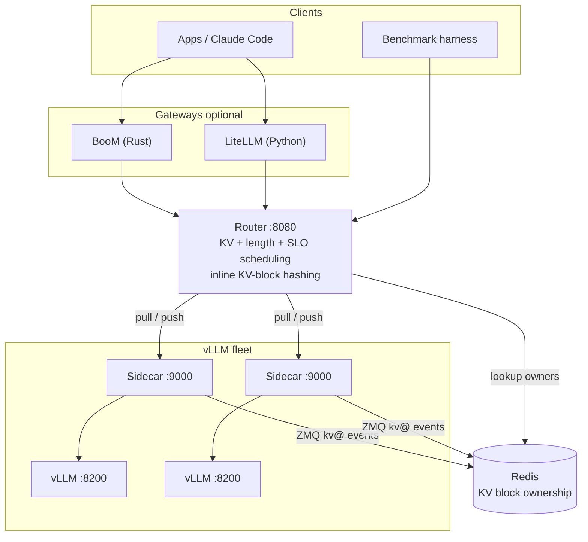

import { Card, CardGrid, LinkCard } from "@astrojs/starlight/components";

**LA-Boom is a distributed serving platform for vLLM on Kubernetes** — a KV-,
length-, and SLO-aware router with per-pod sidecars wrapped around unmodified
vLLM, deployed by a single Helm chart. Route for cache reuse, autoscale per
model, and front it with a gateway for auth and spend. It ships with a
reproducible benchmark harness so you can prove which routing strategy wins,
apples-to-apples.

> **The one-liner:** vLLM's prefix cache makes _where_ a request lands matter
> enormously. Round-robin throws that away. LA-Boom doesn't.

## Key capabilities

<div class="laboom-grid">
<CardGrid stagger>
  <Card title="KV-aware routing" icon="random">
    Scores every queued request against each replica's *live* KV-block ownership
    and places it for maximum prefix reuse — higher hit rates, lower TTFT.
  </Card>
  <Card title="Length & SLO aware" icon="seti:clock">
    Short-first / long-first batching and slack-based deadline scheduling are
    first-class levers, not an afterthought.
  </Card>
  <Card title="Kubernetes-native, one chart" icon="rocket">
    Router, sidecars, Redis, vLLM, gateways, and per-model KEDA autoscaling all
    deploy from the `vllm-kv-stack` Helm chart — no engine fork.
  </Card>
  <Card title="Reproducible benchmarks" icon="approve-check">
    An open-loop load generator plus automated Helm sweeps that archive
    per-request logs, Prometheus metrics, and rendered manifests.
  </Card>
  <Card title="Serve at scale" icon="setting">
    Many models per cluster; multi-node data + expert parallel via
    LeaderWorkerSet; cross-node KV transfer via Mooncake / LMCache.
  </Card>
  <Card title="Gateways & observability" icon="open-book">
    BooM (Rust) and LiteLLM gateways for auth, virtual keys, and spend;
    Prometheus metrics and per-request tracing.
  </Card>
</CardGrid>
</div>

## Architecture

The router holds a central queue and either **pulls** work to sidecars on demand
(capacity-gated, the default) or **pushes** it proactively. Sidecars subscribe to
vLLM's ZMQ KV events and record block ownership in Redis; the router watches
Redis to build a live `block hash → replica` map for prefix-aware placement.



## Quickstart

```bash
# 1. One-time: create the model PV/PVC
helm upgrade --install vllm ./src/core/vllm-kv-stack -n vllm --create-namespace \
  --set modelVolume.create=true --set modelVolume.modelSubPath=placeholder

# 2. Deploy the platform (router + Redis + vLLM + sidecar)
helm upgrade --install vllm ./src/core/vllm-kv-stack -n vllm --create-namespace \
  -f my-values.yaml

# 3. Smoke-check the router (NodePort 30080)
curl http://NODE_IP:30080/health
```

Write `models[]` (and cluster overrides) in `my-values.yaml` — see the
[quickstart](getting-started/quickstart). To drive load and collect artifacts,
use the [benchmark harness](benchmarking/harness).

## Compatibility

LA-Boom is a routing/benchmark layer around **unmodified vLLM**, so it inherits
vLLM's model support and adds Kubernetes-native wiring on top.

| Area | Works with | Notes |
|------|-----------|-------|
| Inference engine | **vLLM** (OpenAI-compatible) | Router + sidecar wrap stock vLLM; no engine fork |
| KV transfer | **Mooncake** (default), **LMCache** P2P | Switch via `lmcache.mode: mooncake \| p2p` |
| Parallelism | **TP**, **DP** + **EP** for MoE | DP/EP via LeaderWorkerSet (e.g. GLM-5 TP8+DP) |
| Orchestration | **Kubernetes 1.28+**, **Helm 3.12+** | Deploy/sweep via the `vllm-kv-stack` chart |
| Autoscaling | **KEDA** | Per-model, opt-in, on queue or KV-cache signals |
| Gateways / auth | **BooM** (Rust), **LiteLLM** (Python) | Virtual keys, rate limiting, spend tracking |
| Clients | **OpenAI API**, **Claude Code** | Anthropic-style access via BooM / LiteLLM |
| Models (validated) | GLM-5, MiniMax-M2, Qwen3 | Any vLLM-supported model works |

## Jump in by role

<CardGrid>
  <LinkCard
    title="New here?"
    description="Deploy the stack with Helm and verify end-to-end."
    href={import.meta.env.BASE_URL + "getting-started/quickstart/"}
  />
  <LinkCard
    title="Understand the design"
    description="Architecture overview, router strategies, and the KV cache flow."
    href={import.meta.env.BASE_URL + "architecture/overview/"}
  />
  <LinkCard
    title="Benchmark & analyze"
    description="The load generator, automated Helm sweeps, and captured artifacts."
    href={import.meta.env.BASE_URL + "benchmarking/harness/"}
  />
  <LinkCard
    title="Operate a cluster"
    description="Cluster setup, registry, autoscaling, and disaster recovery."
    href={import.meta.env.BASE_URL + "operations/cluster-setup/"}
  />
  <LinkCard
    title="Contribute"
    description="Local setup, the test pipeline, pre-commit hooks, and CI."
    href={import.meta.env.BASE_URL + "contributing/development/"}
  />
</CardGrid>
